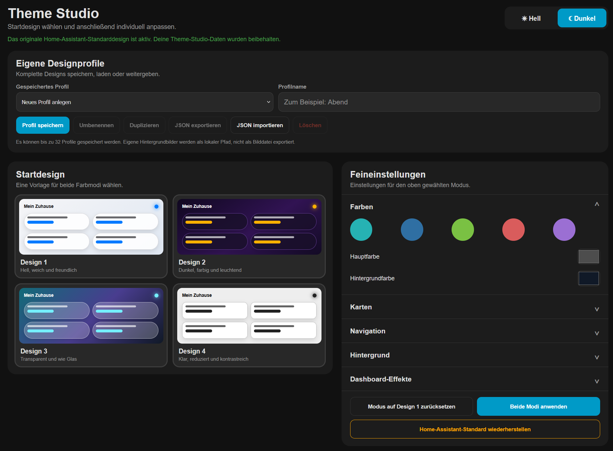
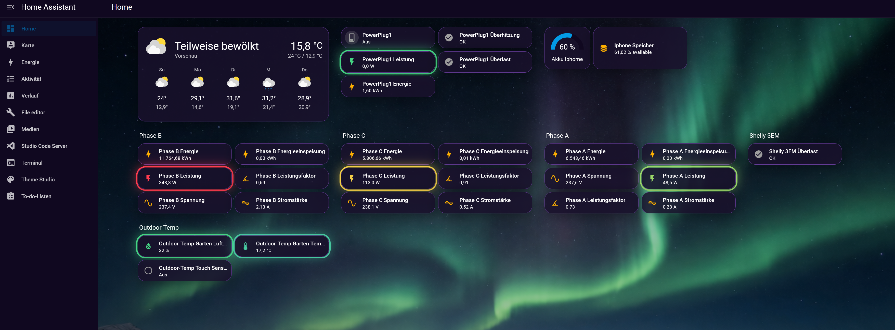
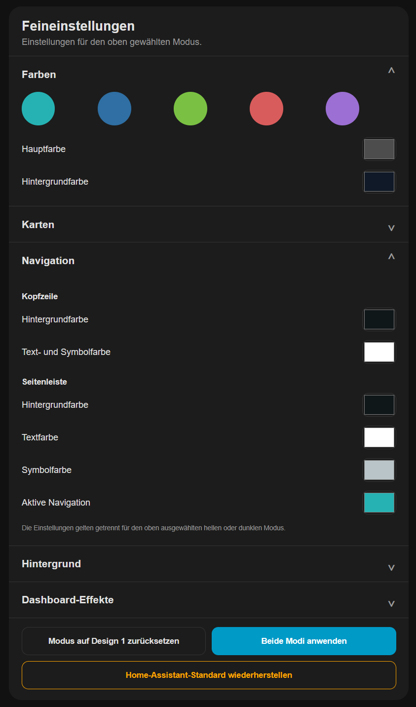
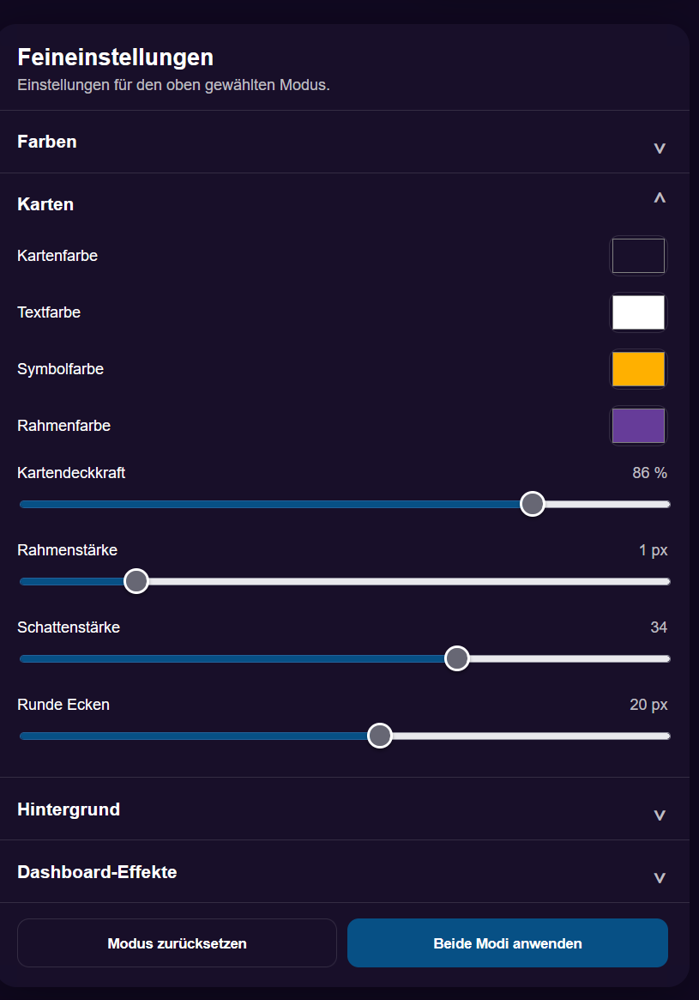
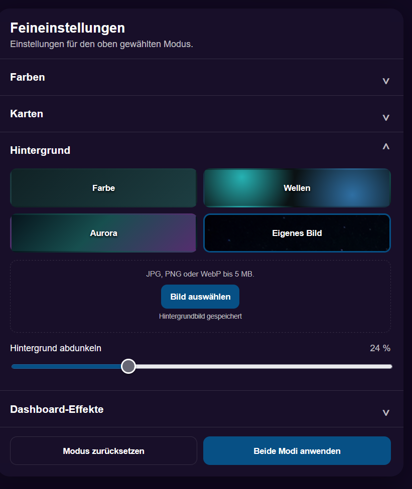
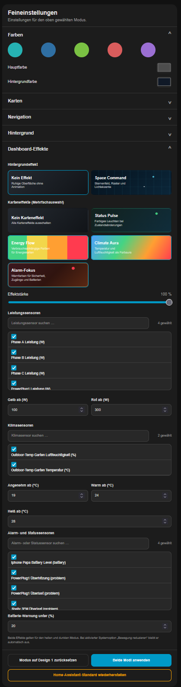

# Theme Studio for Home Assistant

Theme Studio ist eine benutzerdefinierte Home-Assistant-Integration zum Erstellen, Vorschauen und direkten Anwenden eigener Oberflächendesigns.

> Aktuelle Version: **0.3.1**
>
> Theme Studio befindet sich noch in einer frühen Entwicklungsphase. Vor der Installation oder einem Update sollte ein Home-Assistant-Backup erstellt werden.

## Funktionen

- getrennte Einstellungen für hellen und dunklen Modus
- vier Startdesigns als Ausgangspunkt
- eigene Designprofile speichern, laden, umbenennen, duplizieren und löschen
- Designprofile als JSON-Datei exportieren und importieren
- anpassbare Haupt-, Hintergrund-, Karten-, Text-, Symbol- und Rahmenfarben
- Kopfzeile und Seitenleiste pro Farbmodus separat gestalten
- eigene Farben für Navigationshintergrund, Text, Symbole und den aktiven Menüpunkt
- Kartenradius, Deckkraft, Rahmenstärke und Schatten
- Farbverläufe sowie eine Bibliothek für mehrere eigene Hintergrundbilder
- Hintergrundbilder auswählen, umbenennen und sicher löschen
- Dashboard-Hintergrundeffekt **Space Command**
- frei kombinierbare Karteneffekte:
  - **Status Pulse** für gezielt ausgewählte Entitäten
  - **Energy Flow** für Leistungssensoren mit Warn- und Kritisch-Schwellenwerten
  - **Climate Aura** für Temperatur- und Luftfeuchtigkeitssensoren
  - **Alarm-Fokus** für Alarm-, Problem- und Batteriesensoren
- Suche und Mehrfachauswahl in allen Entitätslisten
- Anzeige der Anzahl gewählter Entitäten
- dauerhafte Speicherung der ausgewählten Effekt-Entitäten
- Speicherung aller Einstellungen in Home Assistant
- Erzeugung und direkte Aktivierung eines echten Home-Assistant-Themes
- sichere Rückkehr zum originalen Home-Assistant-Standarddesign
- responsive Bedienung auf Desktop, Tablet und Smartphone

## Screenshots

### Theme Studio und Dashboard





### Feineinstellungen

| Farben und Navigation | Kartendesign |
| --- | --- |
|  |  |

| Hintergrund | Dashboard-Effekte |
| --- | --- |
|  |  |

## Installation über HACS

Theme Studio kann als benutzerdefiniertes Repository über HACS installiert werden:

1. In HACS den Bereich **Integrationen** öffnen.
2. Oben rechts das Drei-Punkte-Menü öffnen und **Benutzerdefinierte Repositorys** auswählen.
3. Als Repository-URL `https://github.com/CjonesLAB/ha-theme-studio` eintragen.
4. Als Kategorie **Integration** auswählen und das Repository hinzufügen.
5. **Theme Studio** in HACS öffnen und die aktuelle Version herunterladen.
6. Home Assistant neu starten.
7. Unter **Einstellungen → Geräte & Dienste → Integration hinzufügen** nach **Theme Studio** suchen und die Integration hinzufügen.

Danach erscheint **Theme Studio** in der Seitenleiste.

## Manuelle Installation

1. Den Ordner `custom_components/theme_studio` aus dem aktuellen Release nach Home Assistant kopieren:

   ```text
   /config/custom_components/theme_studio
   ```

2. In `/config/configuration.yaml` das Laden von Themes und des Effektmoduls eintragen:

   ```yaml
   frontend:
     themes: !include_dir_merge_named themes
     extra_module_url:
       - /theme_studio_files/theme-studio-effects.js
   ```

3. Die Konfiguration prüfen und Home Assistant neu starten:

   ```bash
   ha core check
   ha core restart
   ```

4. Unter **Einstellungen → Geräte & Dienste → Integration hinzufügen** nach **Theme Studio** suchen und die Integration hinzufügen.

5. Danach erscheint **Theme Studio** in der Seitenleiste.

## Bedienung

1. In der Seitenleiste **Theme Studio** öffnen.
2. Ein Startdesign wählen und oben zwischen hellem und dunklem Modus wechseln.
3. Farben, Karten, Navigation und Hintergrund in den Feineinstellungen anpassen.
4. Unter **Dashboard-Effekte** die gewünschten Effekte aktivieren.
5. In den Entitätslisten über das Suchfeld nach Name, Entitäts-ID oder Geräteklasse filtern und mehrere passende Entitäten auswählen.
6. Optional unter **Eigene Designprofile** einen Namen eingeben und das komplette Design als wiederverwendbares Profil speichern.
7. Mit **Beide Modi anwenden** die Einstellungen speichern und das Theme aktivieren.

Mit **Home-Assistant-Standard wiederherstellen** wird Theme Studio für den hellen und dunklen Modus deaktiviert und das originale Home-Assistant-Design wieder aktiviert. Gespeicherte Designprofile und Hintergrundbilder bleiben dabei erhalten. **Modus auf Design 1 zurücksetzen** verändert dagegen nur die Einstellungen des gerade geöffneten Farbmodus.

Gespeicherte Profile können geladen, aktualisiert, umbenannt, dupliziert oder gelöscht werden. Über **JSON exportieren** lassen sie sich sichern und auf einer anderen Theme-Studio-Installation über **JSON importieren** einlesen. Eigene Hintergrundbilder werden dabei nur als lokaler Pfad referenziert; die Bilddatei selbst muss auf dem Zielsystem separat vorhanden sein.

Unter **Hintergrund → Bildbibliothek** können bis zu 24 JPG-, PNG- oder WebP-Dateien verwaltet werden. Bereits vorhandene Theme-Studio-Bilder werden automatisch übernommen. Ein Bild, das vom aktiven Design oder von einem gespeicherten Profil verwendet wird, ist vor versehentlichem Löschen geschützt.

Karteneffekte werden nur auf die jeweils ausgewählten Entitäten angewendet. Dadurch bleiben auch große Dashboards übersichtlich und unnötige Effekte werden vermieden.

## Aktualisierung

### Über HACS

Das Update in HACS installieren und Home Assistant anschließend neu starten.

### Manuell

Den vollständigen Ordner `custom_components/theme_studio` durch die Dateien des neuen Releases ersetzen und Home Assistant neu starten.

Nach jeder Aktualisierung die Home-Assistant-Oberfläche vollständig neu laden:

- Desktop: `Strg + F5`
- Companion App: App vollständig schließen und erneut öffnen

Die aktuelle Version ist auf der [Releases-Seite](https://github.com/CjonesLAB/ha-theme-studio/releases/latest) verfügbar.

## Erzeugte Daten

Theme Studio erzeugt beziehungsweise verwaltet folgende lokale Dateien:

```text
/config/themes/theme_studio.yaml
/config/www/theme_studio/
/config/.storage/theme_studio.settings
/config/.storage/theme_studio.profiles
/config/.storage/theme_studio.backgrounds
```

Diese benutzerspezifischen Dateien gehören nicht zum GitHub-Repository und werden bei einem Update nicht überschrieben.

## Datenschutz

Theme Studio arbeitet lokal in Home Assistant und benötigt keinen externen Cloud-Dienst. Eigene Hintergrundbilder bleiben im lokalen Home-Assistant-Konfigurationsverzeichnis.

## Fehler melden

Fehler und Verbesserungsvorschläge können über den [GitHub-Issue-Tracker](https://github.com/CjonesLAB/ha-theme-studio/issues) gemeldet werden.

Bitte dabei nach Möglichkeit die Home-Assistant-Version, die Theme-Studio-Version, die verwendete Plattform und relevante Protokollmeldungen angeben.

## Lizenz

Theme Studio wird unter der [MIT-Lizenz](LICENSE) veröffentlicht.
