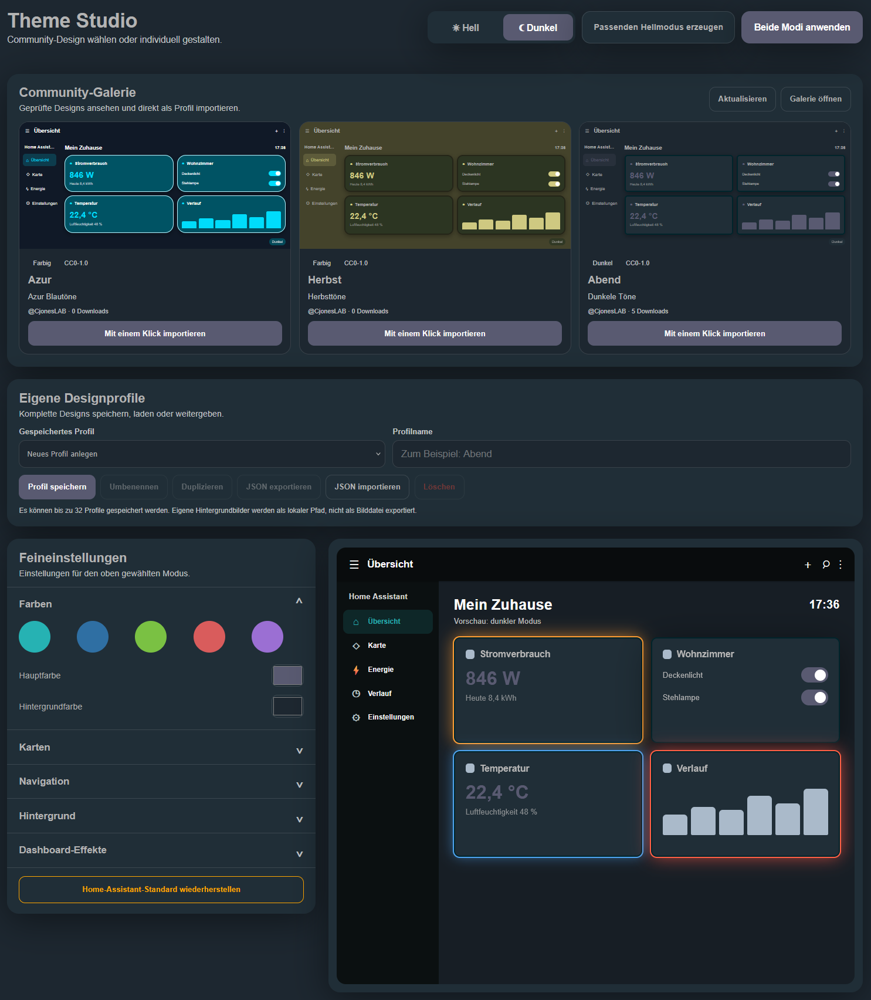

# Theme Studio for Home Assistant

Theme Studio ist eine benutzerdefinierte Home-Assistant-Integration zum Erstellen, Vorschauen und direkten Anwenden eigener Oberflächendesigns.

> Aktuelle Version: **0.4.7**
>
> Theme Studio befindet sich noch in einer frühen Entwicklungsphase. Vor der Installation oder einem Update sollte ein Home-Assistant-Backup erstellt werden.

## Funktionen

- getrennte Einstellungen für hellen und dunklen Modus
- farblich passenden Hell- oder Dunkelmodus aus dem aktuell gestalteten Modus erzeugen
- eigene Designprofile speichern, laden, umbenennen, duplizieren und löschen
- Designänderungen mit Rückgängig und Wiederholen korrigieren
- sichtbarer Hinweis auf noch nicht angewendete Änderungen
- Designprofile ohne lokale Entitätszuordnungen und Hintergrundbild-Pfade als portable JSON-Datei exportieren
- JSON-Dateien vor dem Import serverseitig prüfen und bereinigen
- übersichtliche Importvorschau mit den übernommenen Farben und entfernten lokalen Inhalten
- installierte Theme-Studio-Version direkt im Bedienfeld anzeigen
- geprüfte Community-Designs in einer vollständigen Mini-Dashboard-Vorschau für Hell und Dunkel ansehen und mit einem Klick als lokales Profil importieren
- einzeilige Community-Galerie mit drei sichtbaren Designs auf dem Desktop sowie Pfeilsteuerung und Wischbedienung für weitere Designs
- eigene Designs über [ha-theme-studio.com](https://ha-theme-studio.com/) zur Prüfung und Veröffentlichung in der Community-Galerie einreichen
- anpassbare Haupt-, Hintergrund-, Karten-, Text-, Symbol- und Rahmenfarben
- Kopfzeile und Seitenleiste pro Farbmodus separat gestalten
- eigene Farben für Navigationshintergrund, Text, Symbole und den aktiven Menüpunkt
- Kartenradius, Deckkraft, Rahmenstärke und Schatten
- Farbverläufe sowie eine Bibliothek für mehrere eigene Hintergrundbilder
- Hintergrundbilder auswählen, umbenennen und sicher löschen
- Dashboard-Hintergrundeffekt **Space Command**
- frei kombinierbare Karteneffekte:
  - **Status Pulse** für gezielt ausgewählte Entitäten
  - **Energy Flow** für Leistungssensoren mit Warn- und Kritisch-Schwellenwerten
  - **Climate Aura** für Temperatur- und Luftfeuchtigkeitssensoren
  - **Alarm-Fokus** für Alarm-, Problem- und Batteriesensoren
- Suche und Mehrfachauswahl in allen Entitätslisten
- Anzeige der Anzahl gewählter Entitäten
- dauerhafte Speicherung der ausgewählten Effekt-Entitäten
- Speicherung aller Einstellungen in Home Assistant
- Erzeugung und direkte Aktivierung eines echten Home-Assistant-Themes
- sichere Rückkehr zum originalen Home-Assistant-Standarddesign
- responsive Bedienung auf Desktop, Tablet und Smartphone

## Screenshots

### Theme Studio mit Community-Galerie und Dashboard-Vorschau



### Feineinstellungen

| Farben und Karten | Navigation |
| --- | --- |
|  |  |

| Hintergrund und Bildbibliothek | Dashboard-Effekte und Entitätsauswahl |
| --- | --- |
|  |  |

## Eigenes Design veröffentlichen

Eigene Designprofile können direkt auf [ha-theme-studio.com](https://ha-theme-studio.com/) für die Community-Galerie eingereicht werden. Dazu das Profil in Theme Studio als portable JSON-Datei exportieren, auf der Webseite mit einem GitHub-Konto anmelden und über **Design einreichen** hochladen. Lokale Hintergrundbild-Pfade, Dashboard-Effekte und Entitätszuordnungen werden nicht exportiert. Beim lokalen Import zeigt Theme Studio zunächst eine geprüfte Vorschau und speichert das Profil erst nach ausdrücklicher Bestätigung. Jede Einreichung wird vor der Veröffentlichung geprüft, damit die öffentliche Galerie übersichtlich und qualitativ einheitlich bleibt.

## Installation über HACS

Theme Studio kann als benutzerdefiniertes Repository über HACS installiert werden:

1. In HACS den Bereich **Integrationen** öffnen.
2. Oben rechts das Drei-Punkte-Menü öffnen und **Benutzerdefinierte Repositorys** auswählen.
3. Als Repository-URL `https://github.com/CjonesLAB/ha-theme-studio` eintragen.
4. Als Kategorie **Integration** auswählen und das Repository hinzufügen.
5. **Theme Studio** in HACS öffnen und die aktuelle Version herunterladen.
6. Home Assistant neu starten.
7. Unter **Einstellungen → Geräte & Dienste → Integration hinzufügen** nach **Theme Studio** suchen und die Integration hinzufügen.

Danach erscheint **Theme Studio** in der Seitenleiste.

## Manuelle Installation

1. Den Ordner `custom_components/theme_studio` aus dem aktuellen Release nach Home Assistant kopieren:

   ```text
   /config/custom_components/theme_studio
   ```

2. In `/config/configuration.yaml` das Laden von Themes und des Effektmoduls eintragen:

   ```yaml
   frontend:
     themes: !include_dir_merge_named themes
     extra_module_url:
       - /theme_studio_files/theme-studio-effects.js
   ```

3. Die Konfiguration prüfen und Home Assistant neu starten:

   ```bash
   ha core check
   ha core restart
   ```

4. Unter **Einstellungen → Geräte & Dienste → Integration hinzufügen** nach **Theme Studio** suchen und die Integration hinzufügen.

5. Danach erscheint **Theme Studio** in der Seitenleiste.

## Bedienung

1. In der Seitenleiste **Theme Studio** öffnen.
2. In der **Community-Galerie** ein geprüftes Design auswählen und mit **Mit einem Klick importieren** als lokales Profil übernehmen oder ein vorhandenes eigenes Profil laden.
3. Oben zwischen hellem und dunklem Modus wechseln.
4. Farben, Karten, Navigation und Hintergrund in den Feineinstellungen anpassen.
5. Unter **Dashboard-Effekte** die gewünschten Effekte aktivieren.
6. In den Entitätslisten über das Suchfeld nach Name, Entitäts-ID oder Geräteklasse filtern und mehrere passende Entitäten auswählen.
7. Optional unter **Eigene Designprofile** einen Namen eingeben und das komplette Design als wiederverwendbares Profil speichern.
8. Mit dem jederzeit oben sichtbaren Button **Beide Modi anwenden** die Einstellungen speichern und das Theme aktivieren.

Mit **Home-Assistant-Standard wiederherstellen** wird Theme Studio für den hellen und dunklen Modus deaktiviert und das originale Home-Assistant-Design wieder aktiviert. Gespeicherte Designprofile und Hintergrundbilder bleiben dabei erhalten.

Gespeicherte Profile können geladen, aktualisiert, umbenannt, dupliziert oder gelöscht werden. Das zuletzt mit **Beide Modi anwenden** aktivierte Profil wird beim nächsten Öffnen von Theme Studio automatisch ausgewählt. Über **JSON exportieren** lassen sich die portablen gestalterischen Einstellungen sichern und auf einer anderen Theme-Studio-Installation über **JSON importieren** einlesen. Installationsabhängige Dashboard-Effekte, Entitätszuordnungen und lokale Hintergrundbild-Pfade werden bewusst nicht exportiert.

Die integrierte Community-Galerie zeigt ausschließlich zuvor geprüfte und veröffentlichte Designs von [ha-theme-studio.com](https://ha-theme-studio.com). Jede Vorschau bildet ein vollständiges kleines Home-Assistant-Dashboard mit Kopfzeile, Seitenleiste, Karten, Navigation, Hintergrund und aktivierten Karteneffekten ab. Die Vorschaukarten wechseln zusammen mit der oberen Auswahl zwischen hellem und dunklem Modus. Beim Import wird das Profil erneut durch Home Assistant validiert und anschließend in den lokalen Designprofilen gespeichert. Hintergrundbild-Pfade des Erstellers werden nicht übernommen, da die zugehörige lokale Bilddatei auf dem eigenen System nicht vorhanden ist.

Unter **Hintergrund → Bildbibliothek** können bis zu 24 JPG-, PNG- oder WebP-Dateien verwaltet werden. Bereits vorhandene Theme-Studio-Bilder werden automatisch übernommen. Ein Bild, das vom aktiven Design oder von einem gespeicherten Profil verwendet wird, ist vor versehentlichem Löschen geschützt.

Karteneffekte werden nur auf die jeweils ausgewählten Entitäten angewendet. Dadurch bleiben auch große Dashboards übersichtlich und unnötige Effekte werden vermieden.

## Aktualisierung

### Über HACS

Das Update in HACS installieren und Home Assistant anschließend neu starten.

### Manuell

Den vollständigen Ordner `custom_components/theme_studio` durch die Dateien des neuen Releases ersetzen und Home Assistant neu starten.

Nach jeder Aktualisierung die Home-Assistant-Oberfläche vollständig neu laden:

- Desktop: `Strg + F5`
- Companion App: App vollständig schließen und erneut öffnen

Die aktuelle Version ist auf der [Releases-Seite](https://github.com/CjonesLAB/ha-theme-studio/releases/latest) verfügbar.

## Erzeugte Daten

Theme Studio erzeugt beziehungsweise verwaltet folgende lokale Dateien:

```text
/config/themes/theme_studio.yaml
/config/www/theme_studio/
/config/.storage/theme_studio.settings
/config/.storage/theme_studio.profiles
/config/.storage/theme_studio.backgrounds
```

Diese benutzerspezifischen Dateien gehören nicht zum GitHub-Repository und werden bei einem Update nicht überschrieben.

## Datenschutz

Die Designbearbeitung, Theme-Erzeugung, Profile und eigenen Hintergrundbilder bleiben lokal in Home Assistant. Zum Anzeigen und Importieren der optionalen Community-Galerie stellt Home Assistant eine HTTPS-Verbindung zu `ha-theme-studio.com` her. Dabei können technisch notwendige Verbindungsdaten wie die IP-Adresse in den Serverprotokollen anfallen; Home-Assistant-Zugangsdaten, Entitätszustände und lokale Hintergrundbilder werden nicht übertragen.

## Fehler melden

Fehler und Verbesserungsvorschläge können über den [GitHub-Issue-Tracker](https://github.com/CjonesLAB/ha-theme-studio/issues) gemeldet werden.

Bitte dabei nach Möglichkeit die Home-Assistant-Version, die Theme-Studio-Version, die verwendete Plattform und relevante Protokollmeldungen angeben.

## Lizenz

Theme Studio wird unter der [MIT-Lizenz](LICENSE) veröffentlicht.
