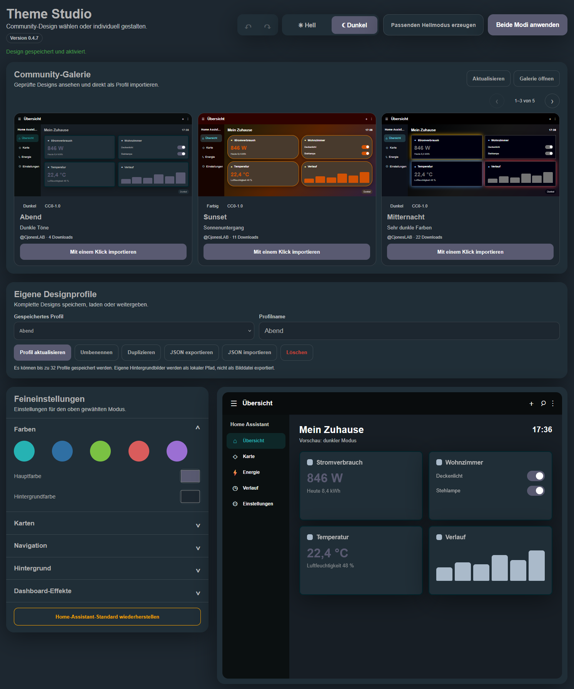

# Theme Studio für Home Assistant

[English](../README.md) | [Deutsch](README.de.md) | [Français](README.fr.md) | [Español](README.es.md)

Theme Studio ist eine benutzerdefinierte Home-Assistant-Integration zum Erstellen, Vorschauen und direkten Anwenden eigener Oberflächendesigns.

> Aktuelle Entwicklungsversion: **0.5.0**
>
> Theme Studio befindet sich noch in einer frühen Entwicklungsphase. Vor der Installation oder einem Update sollte ein Home-Assistant-Backup erstellt werden.

## Funktionen

- getrennte Einstellungen für hellen und dunklen Modus
- farblich passenden Hell- oder Dunkelmodus aus dem aktuell gestalteten Modus erzeugen
- eigene Designprofile speichern, laden, umbenennen, duplizieren und löschen
- Designänderungen mit Rückgängig und Wiederholen korrigieren
- sichtbarer Hinweis auf noch nicht angewendete Änderungen
- automatischer Wiederherstellungspunkt vor dem Anwenden eines Designs
- zuletzt aktives Design auch nach einem Neustart mit einem Klick wiederherstellen
- automatische Bedienoberfläche auf Deutsch, Englisch, Französisch oder Spanisch
- dauerhaft sichtbare Aktionsleiste zum Anwenden und Wechseln des Farbmodus beim Scrollen
- Designprofile ohne lokale Entitätszuordnungen und Hintergrundbild-Pfade als portable JSON-Datei exportieren
- JSON-Dateien vor dem Import serverseitig prüfen und bereinigen
- übersichtliche Importvorschau mit den übernommenen Farben und entfernten lokalen Inhalten
- installierte Theme-Studio-Version direkt im Bedienfeld anzeigen
- geprüfte Community-Designs in einer vollständigen Mini-Dashboard-Vorschau für Hell und Dunkel ansehen und mit einem Klick als lokales Profil importieren
- einzeilige Community-Galerie mit drei sichtbaren Designs auf dem Desktop sowie Pfeilsteuerung und Wischbedienung für weitere Designs
- eigene Designs über [ha-theme-studio.com](https://ha-theme-studio.com/) zur Prüfung und Veröffentlichung in der Community-Galerie einreichen
- anpassbare Haupt-, Hintergrund-, Karten-, Text-, Symbol- und Rahmenfarben
- Kopfzeile und Seitenleiste pro Farbmodus separat gestalten
- eigene Farben für Navigationshintergrund, Text, Symbole und den aktiven Menüpunkt
- Kartenradius, Deckkraft, Rahmenstärke und Schatten
- Farbverläufe sowie eine Bibliothek für mehrere eigene Hintergrundbilder
- Hintergrundbilder auswählen, umbenennen und sicher löschen
- Dashboard-Hintergrundeffekt **Space Command**
- frei kombinierbare Karteneffekte:
  - **Status Pulse** für gezielt ausgewählte Entitäten
  - **Energy Flow** für Leistungssensoren mit Warn- und Kritisch-Schwellenwerten
  - **Climate Aura** für Temperatur- und Luftfeuchtigkeitssensoren
  - **Alarm-Fokus** für Alarm-, Problem- und Batteriesensoren
- Suche und Mehrfachauswahl in allen Entitätslisten
- Anzeige der Anzahl gewählter Entitäten
- dauerhafte Speicherung der ausgewählten Effekt-Entitäten
- Speicherung aller Einstellungen in Home Assistant
- Erzeugung und direkte Aktivierung eines echten Home-Assistant-Themes
- sichere Rückkehr zum originalen Home-Assistant-Standarddesign
- responsive Bedienung auf Desktop, Tablet und Smartphone

## Screenshots

### Theme Studio mit Community-Galerie und Dashboard-Vorschau



### Feineinstellungen

| Farben und Karten | Navigation |
| --- | --- |
|  |  |

| Hintergrund und Bildbibliothek | Dashboard-Effekte und Entitätsauswahl |
| --- | --- |
|  |  |

## Eigenes Design veröffentlichen

Eigene Designprofile können direkt auf [ha-theme-studio.com](https://ha-theme-studio.com/) für die Community-Galerie eingereicht werden. Dazu das Profil in Theme Studio als portable JSON-Datei exportieren, auf der Webseite mit einem GitHub-Konto anmelden und über **Design einreichen** hochladen. Lokale Hintergrundbild-Pfade, Dashboard-Effekte und Entitätszuordnungen werden nicht exportiert. Beim lokalen Import zeigt Theme Studio zunächst eine geprüfte Vorschau und speichert das Profil erst nach ausdrücklicher Bestätigung. Jede Einreichung wird vor der Veröffentlichung geprüft, damit die öffentliche Galerie übersichtlich und qualitativ einheitlich bleibt.

## Installation über HACS

1. In HACS den Bereich **Integrationen** öffnen.
2. Oben rechts das Drei-Punkte-Menü öffnen und **Benutzerdefinierte Repositorys** auswählen.
3. Als Repository-URL `https://github.com/CjonesLAB/ha-theme-studio` eintragen.
4. Als Kategorie **Integration** auswählen und das Repository hinzufügen.
5. **Theme Studio** in HACS öffnen und die aktuelle Version herunterladen.
6. Home Assistant neu starten.
7. Unter **Einstellungen → Geräte & Dienste → Integration hinzufügen** nach **Theme Studio** suchen und die Integration hinzufügen.

Danach erscheint **Theme Studio** in der Seitenleiste.

## Manuelle Installation

1. Den Ordner `custom_components/theme_studio` aus dem aktuellen Release nach `/config/custom_components/theme_studio` kopieren.
2. In `/config/configuration.yaml` das Laden von Themes und des Effektmoduls eintragen:

   ```yaml
   frontend:
     themes: !include_dir_merge_named themes
     extra_module_url:
       - /theme_studio_files/theme-studio-effects.js
   ```

3. Die Konfiguration prüfen und Home Assistant neu starten:

   ```bash
   ha core check
   ha core restart
   ```

4. Unter **Einstellungen → Geräte & Dienste → Integration hinzufügen** nach **Theme Studio** suchen und die Integration hinzufügen.

## Bedienung

1. In der Seitenleiste **Theme Studio** öffnen.
2. In der **Community-Galerie** ein geprüftes Design mit **Mit einem Klick importieren** übernehmen oder ein eigenes Profil laden.
3. Oben zwischen hellem und dunklem Modus wechseln.
4. Farben, Karten, Navigation und Hintergrund anpassen.
5. Unter **Dashboard-Effekte** die gewünschten Effekte aktivieren.
6. Entitätslisten nach Name, Entitäts-ID oder Geräteklasse filtern und mehrere Entitäten auswählen.
7. Optional das komplette Design unter **Eigene Designprofile** speichern.
8. Mit **Beide Modi anwenden** die Einstellungen speichern und das Theme aktivieren.

Mit **Home-Assistant-Standard wiederherstellen** wird Theme Studio für beide Modi deaktiviert und das originale Home-Assistant-Design aktiviert. Profile und Hintergrundbilder bleiben erhalten.

Vor dem Anwenden speichert Theme Studio den bisher aktiven Stand automatisch. **Letztes Design wiederherstellen** kann diesen Stand auch nach einem Neustart aktivieren. Der dabei abgelöste Stand wird zum neuen Wiederherstellungspunkt.

Profile können geladen, aktualisiert, umbenannt, dupliziert oder gelöscht werden. Das zuletzt aktivierte Profil wird beim nächsten Öffnen automatisch ausgewählt. **JSON exportieren** sichert die portablen Gestaltungseinstellungen; **JSON importieren** lädt sie auf einer anderen Installation. Dashboard-Effekte, Entitätszuordnungen und lokale Hintergrundbild-Pfade werden bewusst nicht exportiert.

Die Community-Galerie zeigt ausschließlich geprüfte Designs von [ha-theme-studio.com](https://ha-theme-studio.com). Jede Vorschau stellt ein kompaktes Home-Assistant-Dashboard dar und folgt der Auswahl für hellen oder dunklen Modus. Importierte Profile werden erneut durch Home Assistant validiert. Lokale Hintergrundbild-Pfade des Erstellers werden nicht übernommen.

Unter **Hintergrund → Bildbibliothek** können bis zu 24 JPG-, PNG- oder WebP-Dateien verwaltet werden. Verwendete Bilder sind vor versehentlichem Löschen geschützt. Karteneffekte gelten nur für die ausgewählten Entitäten.

## Aktualisierung

### Über HACS

Das Update in HACS installieren und Home Assistant anschließend neu starten.

### Manuell

Den vollständigen Ordner `custom_components/theme_studio` durch die Dateien des neuen Releases ersetzen und Home Assistant neu starten.

Anschließend die Oberfläche vollständig neu laden:

- Desktop: `Strg + F5`
- Companion App: App vollständig schließen und erneut öffnen

Die aktuelle Version steht auf der [Releases-Seite](https://github.com/CjonesLAB/ha-theme-studio/releases/latest) bereit.

## Automatisierte Tests

GitHub prüft bei jedem Push und Pull Request:

- Syntax aller Python- und JavaScript-Dateien
- sichere Bereinigung portabler Profilimporte
- Entfernung lokaler Bildpfade, Effekte und Entitätszuordnungen
- Ablehnung beschädigter Einstellungs- und Wiederherstellungsdaten
- persistente Wiederherstellungspunkte
- Bereinigung und Begrenzung gespeicherter Profile
- sichere Validierung und Zwischenspeicherung der Galeriedaten
- Erkennung und Schutz lokaler Hintergrundbilder
- Migration älterer Einstellungs- und Effektformate

Die Tests laufen gegen Home Assistant 2026.8.1. Lokal können sie mit Python 3.14 ausgeführt werden:

```bash
python -m pip install --requirement requirements_test.txt
python -m pytest
```

## Erzeugte Daten

```text
/config/themes/theme_studio.yaml
/config/www/theme_studio/
/config/.storage/theme_studio.settings
/config/.storage/theme_studio.profiles
/config/.storage/theme_studio.backgrounds
```

Diese benutzerspezifischen Dateien gehören nicht zum Repository und werden bei Updates nicht überschrieben.

## Datenschutz

Designbearbeitung, Theme-Erzeugung, Profile und eigene Hintergrundbilder bleiben lokal. Für die optionale Galerie stellt Home Assistant eine HTTPS-Verbindung zu `ha-theme-studio.com` her. Dabei können technisch notwendige Verbindungsdaten wie die IP-Adresse in Serverprotokollen anfallen. Zugangsdaten, Entitätszustände und lokale Hintergrundbilder werden nicht übertragen.

## Fehler melden

Fehler und Vorschläge können über den [GitHub-Issue-Tracker](https://github.com/CjonesLAB/ha-theme-studio/issues) gemeldet werden. Bitte möglichst Home-Assistant-Version, Theme-Studio-Version, Plattform und relevante Protokollmeldungen angeben.

## Lizenz

Theme Studio wird unter der [MIT-Lizenz](../LICENSE) veröffentlicht.
