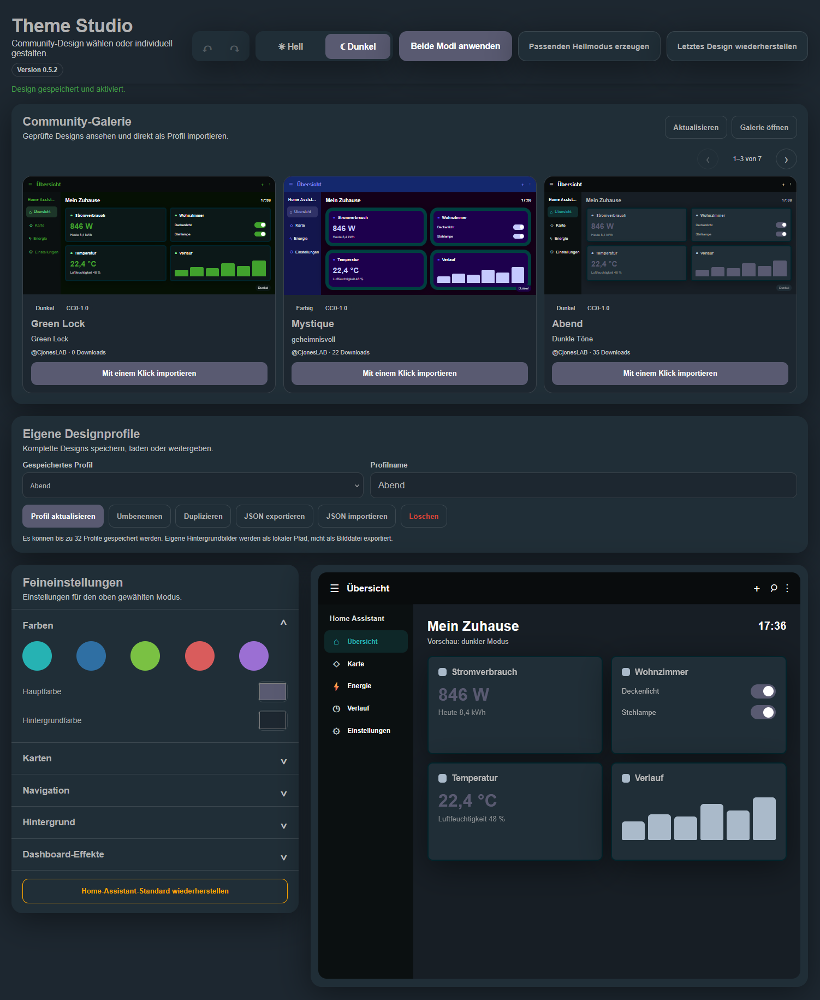
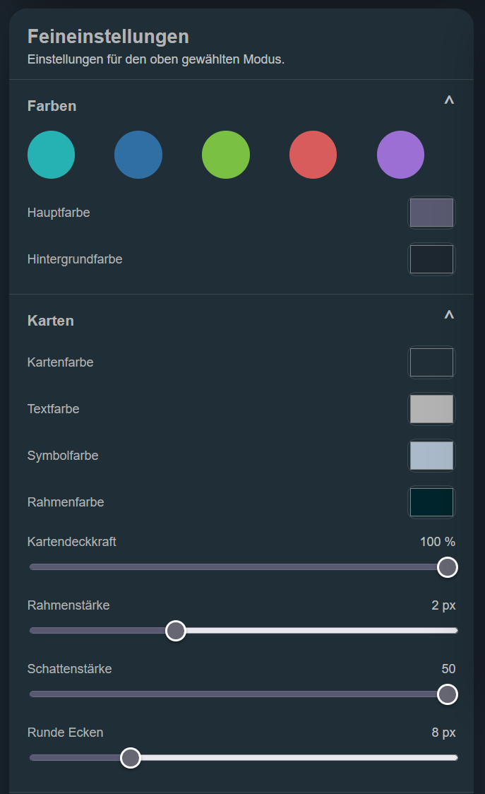
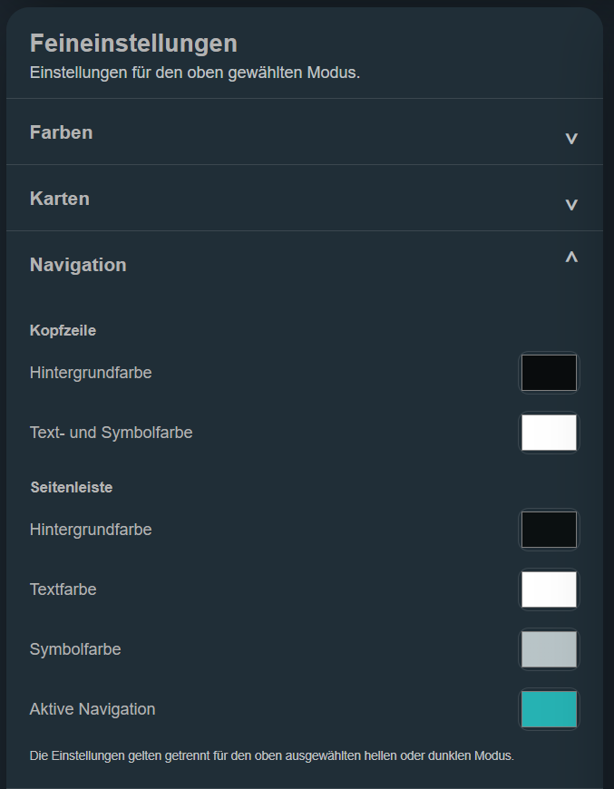
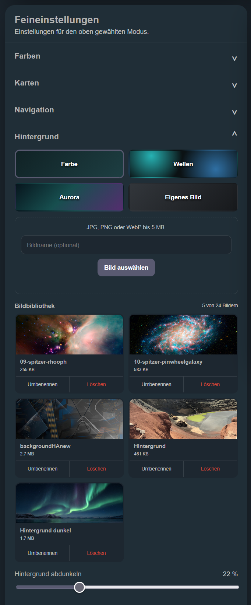
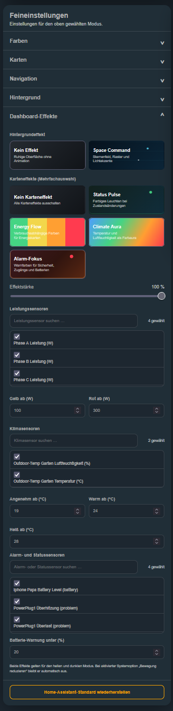

# Theme Studio para Home Assistant

[English](../README.md) | [Deutsch](README.de.md) | [Français](README.fr.md) | [Español](README.es.md)

Theme Studio es una integración personalizada para Home Assistant que permite crear, previsualizar y aplicar directamente tus propios diseños de interfaz.

> Versión de desarrollo actual: **0.5.2**
>
> Theme Studio todavía se encuentra en una fase temprana de desarrollo. Crea una copia de seguridad de Home Assistant antes de instalarlo o actualizarlo.

## Funciones

- ajustes independientes para los modos claro y oscuro
- generación de un modo claro u oscuro a juego a partir del modo que se está editando
- guardar, cargar, renombrar, duplicar y eliminar perfiles personalizados
- deshacer y rehacer cambios del diseño
- aviso visible de cambios todavía no aplicados
- punto de recuperación automático antes de aplicar un diseño
- restauración con un clic del último diseño activo, incluso después de reiniciar
- interfaz automática en alemán, inglés, francés o español
- controles accesibles mediante teclado, foco visible y diálogo de importación accesible
- diagnóstico de Home Assistant respetuoso con la privacidad y limitado a estados técnicos y recuentos
- barra de acciones siempre visible durante el desplazamiento
- exportación JSON portátil sin asignaciones de entidades locales ni rutas de imágenes de fondo
- validación y limpieza de archivos JSON en el servidor antes de importarlos
- vista previa clara con los ajustes conservados y el contenido local eliminado
- visualización de la versión instalada en el panel
- galería de diseños verificados con vista previa completa en modo claro y oscuro e importación con un clic
- galería de una sola fila con tres diseños visibles en escritorio, flechas y navegación mediante gestos
- envío de diseños a [ha-theme-studio.com](https://ha-theme-studio.com/) para su revisión y publicación
- colores configurables para elementos principales, fondo, tarjetas, texto, iconos y bordes
- encabezado y barra lateral configurables por separado para cada modo
- colores propios para el fondo de navegación, texto, iconos y elemento activo
- radio, opacidad, grosor del borde y sombra de las tarjetas
- degradados y biblioteca para varias imágenes de fondo
- selección, cambio de nombre y eliminación segura de imágenes
- efecto de fondo **Space Command**
- efectos de tarjeta combinables:
  - **Status Pulse** para entidades seleccionadas
  - **Energy Flow** para sensores de potencia con umbrales de aviso y críticos
  - **Climate Aura** para sensores de temperatura y humedad
  - **Alert Focus** para sensores de alarma, problemas y batería
- búsqueda y selección múltiple en todas las listas de entidades
- número de entidades seleccionadas
- almacenamiento permanente de las entidades asignadas a efectos
- almacenamiento de todos los ajustes en Home Assistant
- creación y activación directa de un tema real de Home Assistant
- regreso seguro al diseño predeterminado de Home Assistant
- funcionamiento adaptable en ordenador, tableta y teléfono

## Capturas de pantalla

### Theme Studio con galería de la comunidad y vista previa del panel



### Ajustes detallados

| Colores y tarjetas | Navegación |
| --- | --- |
|  |  |

| Fondo y biblioteca | Efectos y selección de entidades |
| --- | --- |
|  |  |

## Publica tu diseño

Los perfiles pueden enviarse directamente a [ha-theme-studio.com](https://ha-theme-studio.com/) para la galería de la comunidad. Exporta el perfil como JSON portátil, inicia sesión en la web con una cuenta de GitHub y utiliza **Enviar diseño**. No se exportan las rutas de imágenes locales, los efectos del panel ni las asignaciones de entidades. Al importar localmente, Theme Studio muestra primero una vista previa validada y solo guarda el perfil después de una confirmación explícita. Cada envío se revisa antes de publicarlo para mantener una galería clara y de calidad uniforme.

## Instalación mediante HACS

1. Abre **Integraciones** en HACS.
2. Abre el menú de tres puntos y selecciona **Repositorios personalizados**.
3. Introduce `https://github.com/CjonesLAB/ha-theme-studio` como URL.
4. Selecciona **Integración** como categoría y añade el repositorio.
5. Abre **Theme Studio** en HACS y descarga la versión actual.
6. Reinicia Home Assistant.
7. Ve a **Ajustes → Dispositivos y servicios → Añadir integración**, busca **Theme Studio** y añade la integración.

Theme Studio aparecerá en la barra lateral.

## Instalación manual

1. Copia la carpeta `custom_components/theme_studio` de la versión actual a `/config/custom_components/theme_studio`.
2. Activa los temas y el módulo de efectos en `/config/configuration.yaml`:

   ```yaml
   frontend:
     themes: !include_dir_merge_named themes
     extra_module_url:
       - /theme_studio_files/theme-studio-effects.js
   ```

3. Comprueba la configuración y reinicia Home Assistant:

   ```bash
   ha core check
   ha core restart
   ```

4. Añade **Theme Studio** desde **Ajustes → Dispositivos y servicios → Añadir integración**.

## Uso

1. Abre **Theme Studio** desde la barra lateral.
2. Elige un diseño verificado en la **Galería de la comunidad** y pulsa **Importar con un clic**, o carga un perfil propio.
3. Cambia entre los modos claro y oscuro en la parte superior.
4. Ajusta los colores, tarjetas, navegación y fondo.
5. Activa los efectos deseados en **Efectos del panel**.
6. Filtra las entidades por nombre, ID o clase de dispositivo y selecciona varias.
7. Si quieres, guarda el diseño completo como perfil reutilizable.
8. Pulsa **Aplicar ambos modos** para guardar los ajustes y activar el tema.

**Restaurar diseño predeterminado de Home Assistant** desactiva Theme Studio en ambos modos y activa el diseño original. Los perfiles y las imágenes guardadas se conservan.

Antes de aplicar un diseño, Theme Studio guarda automáticamente el estado activo. **Restaurar último diseño** permite recuperarlo incluso después de reiniciar. El estado sustituido se convierte en el nuevo punto de recuperación.

Los perfiles pueden cargarse, actualizarse, renombrarse, duplicarse o eliminarse. El último perfil activado se selecciona automáticamente la próxima vez. **Exportar JSON** guarda los ajustes visuales portátiles; **Importar JSON** los carga en otra instalación. Se excluyen expresamente los efectos, las asignaciones de entidades y las rutas de imágenes locales.

La galería integrada solo muestra diseños revisados y publicados en [ha-theme-studio.com](https://ha-theme-studio.com). Cada vista previa representa un panel compacto y sigue el modo claro u oscuro seleccionado. Home Assistant vuelve a validar todos los perfiles importados. Las rutas de imágenes locales del creador no se importan.

En **Fondo → Biblioteca de imágenes** pueden gestionarse hasta 24 archivos JPG, PNG o WebP. Las imágenes utilizadas están protegidas frente a la eliminación accidental. Los efectos de tarjeta solo se aplican a las entidades seleccionadas.

## Actualización

### Mediante HACS

Instala la actualización en HACS y reinicia Home Assistant.

### Manualmente

Sustituye la carpeta completa `custom_components/theme_studio` por los archivos de la nueva versión y reinicia Home Assistant.

Después, vuelve a cargar completamente la interfaz:

- ordenador: `Ctrl + F5`
- aplicación Companion: ciérrala por completo y vuelve a abrirla

La versión actual está disponible en la [página de versiones](https://github.com/CjonesLAB/ha-theme-studio/releases/latest).

## Pruebas automatizadas

En cada push y pull request, GitHub comprueba automáticamente:

- la sintaxis de los archivos Python y JavaScript
- la limpieza segura de perfiles portátiles
- la eliminación de rutas locales, efectos y asignaciones de entidades
- el rechazo de datos dañados de ajustes o recuperación
- la persistencia de los puntos de recuperación
- la limpieza y limitación de perfiles guardados
- la validación y caché seguras de los datos de la galería
- la detección y protección de imágenes locales
- la migración de formatos antiguos de ajustes y efectos

Las pruebas se ejecutan con Home Assistant 2026.8.1. Para ejecutarlas localmente con Python 3.14:

```bash
python -m pip install --requirement requirements_test.txt
python -m pytest
```

## Datos generados

```text
/config/themes/theme_studio.yaml
/config/www/theme_studio/
/config/.storage/theme_studio.settings
/config/.storage/theme_studio.profiles
/config/.storage/theme_studio.backgrounds
```

Estos archivos específicos del usuario no forman parte del repositorio y no se sobrescriben al actualizar.

## Privacidad

La edición de diseños, la creación del tema, los perfiles y las imágenes personalizadas permanecen en Home Assistant. Para mostrar la galería opcional, Home Assistant establece una conexión HTTPS con `ha-theme-studio.com`. Los registros del servidor pueden incluir datos técnicos necesarios, como la dirección IP. No se transmiten credenciales de Home Assistant, estados de entidades ni imágenes locales.

La descarga de diagnóstico disponible en Home Assistant no contiene deliberadamente colores, valores de diseño, ID de entidades, nombres de perfiles, nombres o rutas de imágenes, credenciales ni diseños guardados. Solo informa de la versión de Theme Studio, las versiones de los formatos de almacenamiento, la validez del almacenamiento, la disponibilidad de funciones y recuentos anónimos. Para crear el archivo para una solicitud de soporte, abre **Ajustes → Dispositivos y servicios → Theme Studio → Descargar diagnósticos**.

## Informar de problemas

Informa de errores y sugerencias en el [seguimiento de incidencias de GitHub](https://github.com/CjonesLAB/ha-theme-studio/issues). Incluye, cuando sea posible, las versiones de Home Assistant y Theme Studio, la plataforma y los mensajes de registro relevantes.

## Licencia

Theme Studio se publica bajo la [licencia MIT](../LICENSE).
