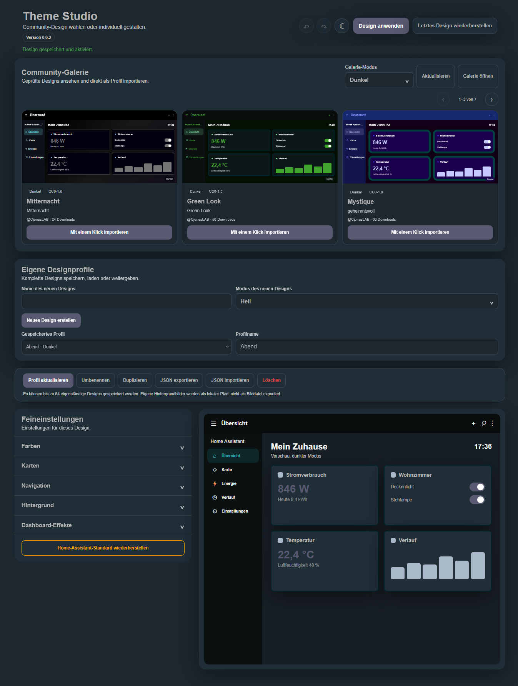
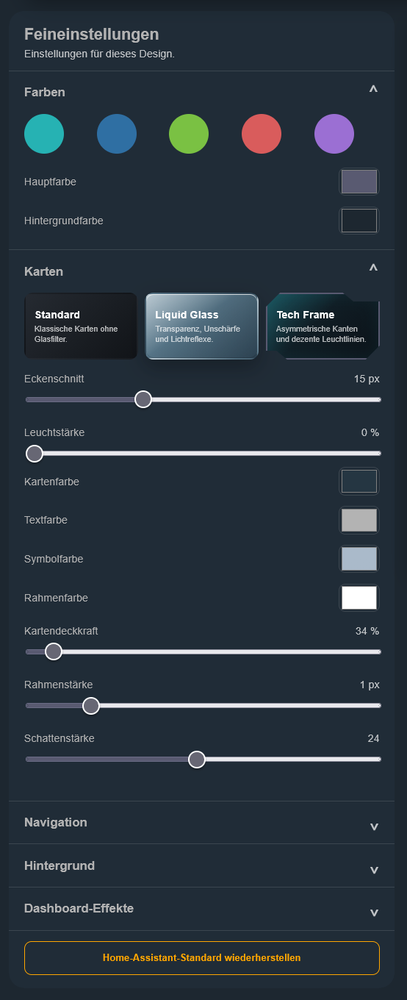

# Theme Studio pour Home Assistant

[English](../README.md) | [Deutsch](README.de.md) | [Français](README.fr.md) | [Español](README.es.md)

Theme Studio est une intégration personnalisée pour Home Assistant permettant de créer, prévisualiser et appliquer directement vos propres designs d’interface.



> Version de développement actuelle : **0.6.3**
>
> Theme Studio est encore à un stade précoce de développement. Créez une sauvegarde de Home Assistant avant toute installation ou mise à jour.

Historique des versions : [Notes de version](https://github.com/CjonesLAB/ha-theme-studio/releases).

## Fonctionnalités

Chaque profil est un thème indépendant **clair** ou **sombre**. Définissez son nom et son mode avec **Créer un thème**, puis personnalisez-le. **Appliquer le thème** active ses couleurs et son mode fixe. Il n’y a plus de bascule ni de génération automatique du mode opposé dans un thème.

Les anciens profils sont séparés en deux profils nommés, sans modifier leurs couleurs enregistrées. Jusqu’à 64 thèmes sont possibles. Le stockage original est sauvegardé avant la première écriture de migration. Créez tout de même une sauvegarde complète de Home Assistant avant l’installation ou une mise à jour.

Les nouveaux exports JSON utilisent le format v2 à un seul thème. Les imports v1 permettent de choisir une variante. La galerie accepte les deux formats. Les thèmes importés conservent leur mode clair/sombre fixe et les aperçus sont filtrés en conséquence.

Les imports de la galerie conservent uniquement le titre comme nom du profil. L’indication séparée du mode n’apparaît qu’une fois ; elle n’est pas répétée pour les anciens noms se terminant déjà par « Clair » ou « Sombre ».

La galerie suit automatiquement le mode du profil chargé. Elle affiche uniquement les thèmes affectés à ce mode et utilise leur mode officiel lors de l’importation. Aucune palette claire ou sombre manquante n’est générée ni recolorée. Les anciennes catégories sans affectation claire/sombre restent masquées jusqu’à leur reclassement.

- enregistrement, chargement, renommage, duplication et suppression de profils personnalisés
- annulation et rétablissement des modifications
- indication visible des modifications non appliquées
- bref rappel visuel pour les modifications non enregistrées et une seule pulsation verte de confirmation après l’enregistrement
- effet d’arrière-plan Space Command avec champ d’étoiles et accents lumineux, sans grille visible
- style de cartes Liquid Glass facultatif avec un réglage de transparence de 0 à 100 %, flou d’arrière-plan, saturation et reflets ; les réglages de matériau incompatibles sont définis automatiquement et verrouillés lorsque le verre est actif
- style de cartes Tech Frame facultatif avec découpes asymétriques, contour fermé configurable, intensité lumineuse, couleur et épaisseur de bordure et ombre ; les titres restent inchangés tandis que les cartes normales et les fenêtres de détail opaques utilisent le cadre choisi
- les effets du tableau de bord sont automatiquement désactivés dans les réglages Home Assistant sous `/config` et dans les fenêtres superposées
- point de restauration automatique avant l’application d’un design
- restauration en un clic du dernier design actif, même après un redémarrage
- interface automatique en allemand, anglais, français ou espagnol
- commandes accessibles au clavier, focus visible et boîte de dialogue d’importation accessible
- diagnostic Home Assistant respectueux de la vie privée, limité aux états techniques et aux comptages
- barre d’actions toujours visible pendant le défilement
- export JSON portable sans associations d’entités locales ni chemins d’images d’arrière-plan
- validation et nettoyage côté serveur des fichiers JSON avant importation
- aperçu d’importation indiquant les réglages conservés et les contenus locaux supprimés
- affichage de la version installée dans le panneau
- galerie de designs vérifiés avec aperçu complet en mode clair et sombre et importation en un clic
- galerie sur une seule ligne avec trois designs visibles sur ordinateur, flèches et navigation tactile
- envoi de designs sur [ha-theme-studio.com](https://ha-theme-studio.com/) pour vérification et publication
- couleurs principales, arrière-plans, cartes, textes, icônes et bordures configurables
- en-tête et barre latérale configurables séparément pour chaque mode
- couleurs personnalisées pour la navigation, le texte, les icônes et l’élément actif
- rayon, opacité, bordure et ombre des cartes
- dégradés et bibliothèque de plusieurs images d’arrière-plan
- sélection, renommage et suppression sécurisée des images
- effet d’arrière-plan **Space Command**
- effets de carte combinables :
  - **Status Pulse** pour les entités sélectionnées
  - **Energy Flow** pour les capteurs de puissance avec seuils d’avertissement et critiques
  - **Climate Aura** pour les capteurs de température et d’humidité
  - **Alert Focus** pour les capteurs d’alarme, de problème et de batterie
- recherche et sélection multiple dans toutes les listes d’entités
- affichage du nombre d’entités sélectionnées
- conservation des entités affectées aux effets
- enregistrement de tous les réglages dans Home Assistant
- création et activation directe d’un véritable thème Home Assistant
- retour sécurisé au design Home Assistant d’origine
- interface adaptée aux ordinateurs, tablettes et smartphones

## Captures d’écran

### Réglages avancés

| Couleurs et cartes | Navigation |
| --- | --- |
|  |  |

| Arrière-plan et bibliothèque | Effets et sélection d’entités |
| --- | --- |
|  |  |

## Publier votre design

Les profils peuvent être envoyés directement sur [ha-theme-studio.com](https://ha-theme-studio.com/) pour la galerie communautaire. Exportez le profil au format JSON portable, connectez-vous au site avec un compte GitHub, puis utilisez **Soumettre un design**. Les chemins d’images locaux, les effets du tableau de bord et les associations d’entités ne sont pas exportés. Lors d’une importation locale, Theme Studio affiche d’abord un aperçu validé et n’enregistre le profil qu’après confirmation. Chaque envoi est vérifié avant publication afin de préserver une galerie claire et cohérente.

## Installation avec HACS

1. Ouvrez **Intégrations** dans HACS.
2. Ouvrez le menu à trois points et sélectionnez **Dépôts personnalisés**.
3. Saisissez `https://github.com/CjonesLAB/ha-theme-studio` comme URL.
4. Sélectionnez la catégorie **Intégration** et ajoutez le dépôt.
5. Ouvrez **Theme Studio** dans HACS et téléchargez la version actuelle.
6. Redémarrez Home Assistant.
7. Ouvrez **Paramètres → Appareils et services → Ajouter une intégration**, recherchez **Theme Studio**, puis ajoutez l’intégration.

Theme Studio apparaît ensuite dans la barre latérale.

## Installation manuelle

1. Copiez le dossier `custom_components/theme_studio` de la version actuelle vers `/config/custom_components/theme_studio`.
2. Activez les thèmes et le module d’effets dans `/config/configuration.yaml` :

   ```yaml
   frontend:
     themes: !include_dir_merge_named themes
     extra_module_url:
       - /theme_studio_files/theme-studio-effects.js?v=0.6.3
   ```

3. Vérifiez la configuration et redémarrez Home Assistant :

   ```bash
   ha core check
   ha core restart
   ```

4. Ajoutez ensuite **Theme Studio** depuis **Paramètres → Appareils et services → Ajouter une intégration**.

## Utilisation

1. Ouvrez **Theme Studio** depuis la barre latérale.
2. Choisissez un design vérifié dans la **Galerie communautaire** et utilisez **Importer en un clic**, ou chargez votre propre profil.
3. Choisissez un thème enregistré ou créez un thème avec un nom et un mode fixe clair/sombre.
4. Ajustez les couleurs, cartes, éléments de navigation et arrière-plans.
5. Activez les effets souhaités sous **Effets du tableau de bord**.
6. Filtrez les entités par nom, identifiant ou classe d’appareil et sélectionnez-en plusieurs.
7. Enregistrez éventuellement le design complet comme profil réutilisable.
8. Sélectionnez **Appliquer le thème** pour enregistrer et activer le thème.

**Restaurer le thème Home Assistant par défaut** désactive Theme Studio et réinitialise l’apparence de l’utilisateur actuel sur le thème Home Assistant par défaut en mode **Auto**. Les options natives **Auto / Clair / Sombre** redeviennent disponibles. Les profils et images enregistrés sont conservés. Les anciennes installations restées sur Theme Studio après une restauration sont réparées automatiquement à l’ouverture du panneau.

Avant chaque application, Theme Studio sauvegarde automatiquement l’état actif. **Restaurer le dernier design** permet de le réactiver même après un redémarrage. L’état remplacé devient à son tour le nouveau point de restauration.

Les profils peuvent être chargés, mis à jour, renommés, dupliqués ou supprimés. Le dernier profil activé est sélectionné automatiquement à la prochaine ouverture. **Exporter le JSON** enregistre les réglages visuels portables ; **Importer le JSON** les charge dans une autre installation. Les effets, associations d’entités et chemins d’images locaux sont volontairement exclus.

Les entrées des listes déroulantes utilisent une couleur de sélection fixe et fortement contrastée afin que les noms de profils restent lisibles, même avec un design très clair.

La galerie intégrée affiche uniquement les designs vérifiés et publiés sur [ha-theme-studio.com](https://ha-theme-studio.com). Chaque aperçu reproduit un tableau de bord compact et suit le mode clair ou sombre sélectionné. Home Assistant valide de nouveau chaque profil importé. Les chemins d’images locaux du créateur ne sont pas importés.

Jusqu’à 24 fichiers JPG, PNG ou WebP peuvent être gérés dans **Arrière-plan → Bibliothèque d’images**. Les images utilisées sont protégées contre une suppression accidentelle. Les effets de carte s’appliquent uniquement aux entités sélectionnées.

## Mise à jour

### Avec HACS

Installez la mise à jour dans HACS, puis redémarrez Home Assistant.

### Manuellement

Remplacez l’intégralité du dossier `custom_components/theme_studio` par les fichiers de la nouvelle version et redémarrez Home Assistant.

Rechargez ensuite complètement l’interface :

- ordinateur : `Ctrl + F5`
- application Companion : fermez complètement l’application puis rouvrez-la

La version actuelle est disponible sur la [page des versions](https://github.com/CjonesLAB/ha-theme-studio/releases/latest).

## Tests automatisés

À chaque push et pull request, GitHub vérifie automatiquement :

- la syntaxe des fichiers Python et JavaScript
- le nettoyage sécurisé des profils portables
- la suppression des chemins locaux, effets et associations d’entités
- le rejet des données de réglages ou de restauration endommagées
- la conservation des points de restauration
- le nettoyage et la limitation des profils enregistrés
- la validation et la mise en cache sécurisées des données de la galerie
- la détection et la protection des images locales
- la migration des anciens formats de réglages et d’effets

Les tests s’exécutent avec Home Assistant 2026.8.1. Pour les lancer localement avec Python 3.14 :

```bash
python -m pip install --requirement requirements_test.txt
python -m pytest
```

## Données créées

```text
/config/themes/theme_studio.yaml
/config/www/theme_studio/
/config/.storage/theme_studio.settings
/config/.storage/theme_studio.profiles
/config/.storage/theme_studio.backgrounds
```

Ces fichiers propres à l’utilisateur ne font pas partie du dépôt et ne sont pas écrasés par une mise à jour.

## Confidentialité

La modification des designs, la création du thème, les profils et les images personnalisées restent dans Home Assistant. Pour afficher la galerie facultative, Home Assistant établit une connexion HTTPS avec `ha-theme-studio.com`. Des données techniques nécessaires, telles que l’adresse IP, peuvent apparaître dans les journaux du serveur. Les identifiants Home Assistant, les états des entités et les images locales ne sont pas transmis.

Le téléchargement de diagnostic proposé par Home Assistant ne contient volontairement aucune couleur, valeur de design, ID d’entité, nom de profil, nom ou chemin d’image, information d’identification ou design enregistré. Il indique uniquement la version de Theme Studio, les versions des formats de stockage, la validité des stockages, la disponibilité des fonctions et des comptages anonymes. Pour créer le fichier destiné au support, ouvrez **Paramètres → Appareils et services → Theme Studio → Télécharger les diagnostics**.

## Signaler un problème

Signalez les erreurs et suggestions dans le [système de suivi GitHub](https://github.com/CjonesLAB/ha-theme-studio/issues). Indiquez si possible les versions de Home Assistant et Theme Studio, la plateforme et les messages de journal pertinents.

## Transparence du développement

Certaines parties du développement, de la révision, des tests et de la documentation ont été réalisées avec l’aide d’OpenAI Codex. Les commits créés avec cette assistance portent la mention `Assisted-by: OpenAI Codex`. Cette mention ne représente pas un compte collaborateur GitHub et n’accorde aucun accès au dépôt.

## Licence

Theme Studio est publié sous [licence MIT](../LICENSE).
