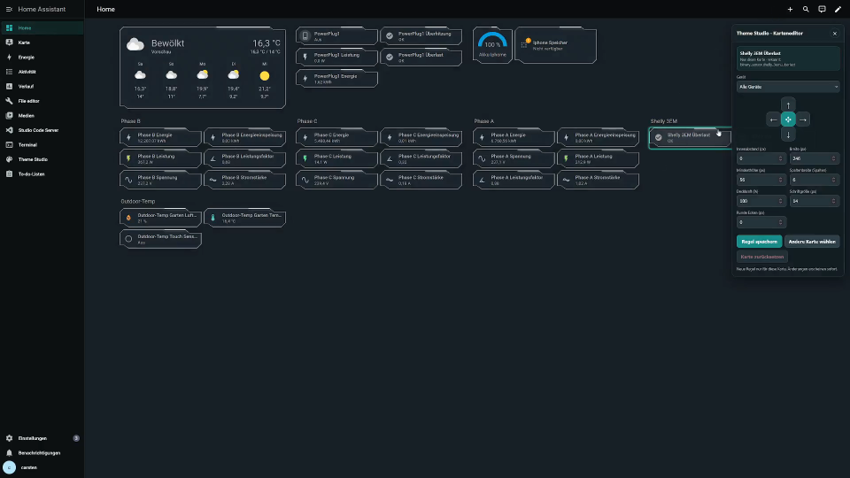

# Theme Studio 0.8.2 - Benutzerhandbuch

[English](USER_GUIDE.en.md) | **Deutsch** | [Français](GUIDE_UTILISATEUR.fr.md) | [Español](GUIA_USUARIO.es.md)

[PDF herunterladen](../downloads/theme-studio-benutzerhandbuch-de.pdf) | [Aktuelle Version](https://github.com/CjonesLAB/ha-theme-studio/releases/latest) | [Fehler melden](https://github.com/CjonesLAB/ha-theme-studio/issues)

Dieses Handbuch erklärt Theme Studio vollständig - von der Installation bis zur gezielten Bearbeitung einzelner Dashboard-Karten. Es gilt für Version **0.8.2**.

> Vor Installation, Update oder größeren Designänderungen immer ein vollständiges Home-Assistant-Backup erstellen.


## Inhalt

1. Voraussetzungen und Kompatibilität
2. Installation
3. Erster Start und Bedienoberfläche
4. Community-Galerie
5. Eigene Designprofile
6. Farben, Karten, Navigation und Hintergrund
7. Dashboard- und Karteneffekte
8. Expertenmodus und direkter Karteneditor
9. Anwenden, Rückgängig, Wiederherstellen und Zurücksetzen
10. JSON-Import, Export und Veröffentlichung
11. Benutzerbezogene Einstellungen, Daten und Datenschutz
12. Aktualisierung
13. Fehlerbehebung und bewährte Vorgehensweise

## 1. Voraussetzungen und Kompatibilität

Theme Studio ist eine benutzerdefinierte Home-Assistant-Integration. Für die Installation werden Administratorrechte benötigt. Für die normale Gestaltung genügt anschließend ein reguläres Benutzerkonto.

Theme Studio erzeugt ein echtes Home-Assistant-Theme. Farben und kompatible Theme-Variablen können daher auf vielen Seiten wirken. Karteneffekte, Experten-CSS und der direkte Karteneditor benötigen jedoch die übliche **Lovelace-Karten- und Layoutstruktur**.

> **Wichtige Einschränkung:** Vollständig selbst entwickelte Dashboards oder Custom Panels, die ihre eigene HTML- oder Web-Component-Struktur erzeugen, werden von Karteneffekten, Experten-CSS und dem direkten Karteneditor nicht unterstützt. Grundfarben können dort weiterhin funktionieren, die Effekte sind aber nicht gewährleistet.

Zusätzlich gilt:

- Dashboard-Effekte werden in Home-Assistant-Einstellungen unter `/config` und in Dialogfenstern nicht angewendet.
- Die Systemoption **Bewegung reduzieren** deaktiviert animierte Effekte automatisch.
- Expertenregeln können nach einem Home-Assistant-Update angepasst werden müssen.
- Oberfläche und Bedienung sind für Desktop, Tablet und Smartphone ausgelegt.

## 2. Installation

### 2.1 Empfohlen: Installation über HACS

1. In HACS **Integrationen** öffnen.
2. Oben rechts das Drei-Punkte-Menü wählen und **Benutzerdefinierte Repositorys** öffnen.
3. `https://github.com/CjonesLAB/ha-theme-studio` als Repository eintragen.
4. Als Kategorie **Integration** auswählen und hinzufügen.
5. **Theme Studio** öffnen und die aktuelle Version herunterladen.
6. Home Assistant neu starten.
7. **Einstellungen -> Geräte & Dienste -> Integration hinzufügen** öffnen.
8. Nach **Theme Studio** suchen und die Integration hinzufügen.

Danach erscheint **Theme Studio** in der Seitenleiste. Das Modul für Dashboard-Effekte wird automatisch registriert. Ein Eintrag unter `frontend.extra_module_url` ist nicht erforderlich.

### 2.2 Manuelle Installation

1. Das Installationspaket der aktuellen GitHub-Version herunterladen.
2. Den enthaltenen Ordner `theme_studio` nach `/config/custom_components/theme_studio` kopieren.
3. Sicherstellen, dass Themes in `/config/configuration.yaml` aktiviert sind:

```yaml
frontend:
  themes: !include_dir_merge_named themes
```

4. Die Konfiguration prüfen und Home Assistant neu starten.
5. Theme Studio anschließend unter **Einstellungen -> Geräte & Dienste** als Integration hinzufügen.

Nach einer Installation oder Aktualisierung den Browser mit `Strg + F5` vollständig neu laden. In der Companion App die App vollständig schließen und erneut öffnen.

## 3. Erster Start und Bedienoberfläche

Theme Studio wird über den Eintrag in der Home-Assistant-Seitenleiste geöffnet. Oben befinden sich die wichtigsten Aktionen:

- **Rückgängig / Wiederholen:** noch nicht angewendete Bearbeitungsschritte korrigieren.
- **Design anwenden:** aktuelle Werte speichern, Theme erzeugen und für den aktuellen Benutzer aktivieren.
- **Letztes Design wiederherstellen:** zum automatisch gesicherten vorherigen Stand wechseln.
- **Versionsanzeige:** zeigt die installierte Theme-Studio-Version.

Die Seite gliedert sich in drei Hauptbereiche:

1. **Community-Galerie** für geprüfte Designs.
2. **Eigene Designprofile** zum Speichern und Austauschen kompletter Designs.
3. **Feineinstellungen** mit Farben, Karten, Navigation, Hintergrund und Effekten.

Die Vorschau reagiert sofort auf Änderungen. Das echte Home-Assistant-Theme ändert sich erst nach **Design anwenden**. Ein sichtbarer Hinweis erinnert an noch nicht angewendete oder noch nicht im Profil gespeicherte Änderungen.

## 4. Community-Galerie

Die Galerie lädt geprüfte Designs von [ha-theme-studio.com](https://ha-theme-studio.com/). Die Vorschau zeigt ein kompaktes Dashboard und folgt dem hellen oder dunklen Modus des ausgewählten Designs.

So wird ein Design übernommen:

1. Galerie bei Bedarf mit **Aktualisieren** neu laden.
2. Mit Pfeilen oder Wischgeste durch weitere Designs wechseln.
3. Beim gewünschten Eintrag **Mit einem Klick importieren** wählen.
4. Das importierte Profil unter **Eigene Designprofile** auswählen.
5. **Design anwenden** drücken.

Galerieprofile werden vor dem Speichern erneut validiert. Lokale Bildpfade des Erstellers werden nicht übernommen, da die Bilddateien auf der eigenen Installation nicht vorhanden sind.

## 5. Eigene Designprofile

Ein Profil ist immer genau **ein helles oder ein dunkles Design**. Es gibt innerhalb eines Profils keine automatische Gegenvariante.

### Neues Profil erstellen

1. Einen eindeutigen Namen eingeben.
2. Als Modus **Hell** oder **Dunkel** wählen.
3. **Neues Design erstellen** drücken.
4. Das Design in den Feineinstellungen bearbeiten.
5. **Profil speichern** und danach **Design anwenden**.

### Vorhandene Profile verwalten

- **Laden:** Profilwerte in den Editor übernehmen.
- **Profil aktualisieren:** aktuelle Änderungen in das ausgewählte Profil schreiben.
- **Umbenennen:** nur den Profilnamen ändern.
- **Duplizieren:** eine unabhängige Kopie als Ausgangspunkt erzeugen.
- **Löschen:** Profil entfernen; das derzeit aktive Theme bleibt bis zur nächsten Anwendung bestehen.

Es können bis zu 64 eigenständige Designs gespeichert werden. Das zuletzt angewendete Profil wird beim nächsten Öffnen automatisch ausgewählt.

## 6. Farben, Karten, Navigation und Hintergrund

### 6.1 Farben

Unter **Farben** stehen eine Hauptfarbe, vordefinierte Farbakzente sowie Hintergrundfarben zur Verfügung. Farbfelder öffnen den nativen Farbwähler. Prüfe helle und dunkle Textkontraste in der Vorschau, bevor das Design angewendet wird.

### 6.2 Karten


Es gibt drei Kartenstile:

- **Standard:** klassische Home-Assistant-Karten ohne Glasfilter.
- **Liquid Glass:** transparente Karten mit Unschärfe, Sättigung und Lichtreflexen. Theme Studio steuert dabei widersprüchliche Materialwerte automatisch.
- **Tech Frame:** asymmetrisch geschnittene Ecken mit geschlossener Kontur, einstellbarem Leuchten, Rahmen und Schatten.

Je nach Stil können Eckenradius beziehungsweise Eckenschnitt, Kartenfarbe, Text- und Symbolfarbe, Rahmenfarbe, Deckkraft, Rahmenstärke, Schatten, Unschärfe und Leuchtstärke eingestellt werden.

### 6.3 Navigation


Kopfzeile und Seitenleiste lassen sich mit eigenen Hintergrund-, Text-, Symbol- und Akzentfarben gestalten. Der aktive Menüpunkt kann gesondert hervorgehoben werden. Änderungen sollten bei geöffneter und eingeklappter Seitenleiste geprüft werden.

### 6.4 Hintergrund


Zur Verfügung stehen einfarbige Flächen, Farbverläufe und eigene Bilder. In der Bildbibliothek können bis zu 24 JPG-, PNG- oder WebP-Dateien verwaltet werden.

- Nur Administratoren können gemeinsame Hintergrundbilder hinzufügen, umbenennen oder löschen.
- Jeder Benutzer kann ein vorhandenes Bild für sein eigenes Design auswählen.
- Bilder, die vom aktiven Design oder einem Profil verwendet werden, sind vor versehentlichem Löschen geschützt.
- Mit **Hintergrund abdunkeln** bleibt Text vor hellen Bildern lesbar.

## 7. Dashboard- und Karteneffekte


### Hintergrundeffekt

**Space Command** erzeugt ein Sternenfeld mit Lichtakzenten. Der Effekt gilt in hellem und dunklem Modus, bleibt aber bei aktivierter Systemoption **Bewegung reduzieren** ausgeschaltet.

### Karteneffekte

Karteneffekte werden nur auf ausgewählte Entitäten angewendet:

- **Status Pulse:** pulsierende Hervorhebung für Statuswerte.
- **Energy Flow:** energieabhängige Darstellung für Leistungssensoren; Warn- und Kritisch-Schwellenwerte sind einstellbar.
- **Climate Aura:** temperatur- oder feuchteabhängige Akzentfarben.
- **Alarm-Fokus:** auffällige Markierung für Alarm-, Problem- und Batteriesensoren.

Entitäten lassen sich nach Name, Entitäts-ID oder Geräteklasse suchen. Mehrere Treffer können gleichzeitig gewählt werden. **Alle Karteneffekte ausschalten** entfernt die Zuweisungen.

Wenn eine Karte keine Standard-Lovelace-Struktur besitzt, kann Theme Studio die zugehörige Entität eventuell nicht erkennen. In vollständig eigenen Dashboards sind diese Effekte nicht nutzbar.

## 8. Expertenmodus und direkter Karteneditor

Der Expertenmodus befindet sich unter **Dashboard-Effekte**. Er ist optional und nur für das aktuelle Benutzerkonto aktiv.

> **Experimentell:** Experten-CSS und der direkte Karteneditor greifen in die Lovelace-Darstellung ein und können sich nach Home-Assistant-Updates anders verhalten. Vorher ein Backup erstellen und Änderungen sorgfältig testen. Desktop und Tablet bieten den vollständigen Editor. Auf Smartphones ist der Kartenmodus auf das Verschieben beschränkt.

### 8.1 Aktivieren

1. Den Schalter **Expertenmodus: eigenes Dashboard-CSS** aktivieren.
2. Den Warnhinweis bestätigen.
3. Ein normales Lovelace-Dashboard öffnen.
4. In der oberen Dashboard-Leiste erscheint das Theme-Studio-Symbol neben den normalen Aktionen.

Das Symbol erscheint nur auf echten Lovelace-Dashboards und nur bei aktiviertem Expertenmodus. In Einstellungen, Terminal, File Editor, To-do-Listen und Custom Panels bleibt es ausgeblendet.

### 8.2 Eine oder mehrere Karten auswählen

1. Das Theme-Studio-Symbol anklicken.
2. Die gewünschte Karte im Dashboard auswählen.
3. Für eine Mehrfachauswahl `Strg` gedrückt halten und weitere Karten anklicken.
4. Die ausgewählte Karte behält ihre normale Außenansicht; nur der innere Bereich wird dezent hervorgehoben.



### 8.3 Werte bearbeiten

Der Editor zeigt zunächst die gemessenen Ausgangswerte der Karte. Dadurch ändert sich die Kartengröße nicht plötzlich, sobald ein einzelnes Feld bearbeitet wird.

Verfügbar sind:

- Innenabstand
- Breite und Mindesthöhe
- Spaltenbreite
- horizontale und vertikale Position
- Deckkraft
- Schriftgröße
- runde Ecken

Änderungen werden direkt im Dashboard angezeigt. Das große Kreuz in der Mitte kann in alle Richtungen gezogen oder über seine Richtungstasten bedient werden. Das Editorfenster selbst lässt sich verschieben, damit verdeckte Karten erreichbar bleiben.

Auf Smartphones erscheint kein Editorfenster. Den Kartenmodus über das Dashboard-Menü starten, eine Karte mit einem Finger direkt verschieben und den Modus über dasselbe Menü beenden. Die endgültige Position wird automatisch als eigene Smartphone-Regel gespeichert. Größe, Abstände, Spaltenbreite, Deckkraft, Schriftgröße, Rundung, Mehrfachauswahl und Reset bleiben Funktionen für Desktop und Tablet.

Während der normale Dashboard-Bearbeitungsmodus von Home Assistant aktiv ist, blendet Theme Studio seinen Kartenmodus aus. Beide Bearbeitungsarten können dadurch nicht gleichzeitig laufen.

### 8.4 Speichern und zurücksetzen

- **Regel speichern** legt für jede ausgewählte Karte eine eigene Regel mit stabilem Kartenschlüssel an.
- **Andere Karte wählen** beendet die aktuelle Auswahl und startet eine neue.
- **Karte zurücksetzen** entfernt die Anpassung der aktuellen Karte.
- Bei einer Mehrfachauswahl kann die gesamte Gruppe zurückgesetzt werden.

Regeln können anschließend in Theme Studio aktiviert, deaktiviert, bearbeitet, dupliziert oder gelöscht werden. Eine Gerätebegrenzung auf Desktop, Tablet oder Smartphone ist möglich.

### 8.5 Erweiterte Regeln und freies CSS

Der erweiterte Regel-Editor kann alle Karten, eine bestimmte Entität, eine eigene Karten-ID oder eine direkt ausgewählte Karte ansprechen. Eine eindeutige ID wird in der YAML-Konfiguration einer Karte ergänzt:

```yaml
theme_studio_id: energie
```

Das optionale freie CSS ist nur für erfahrene Benutzer gedacht. `@import`, Remote- und Data-URLs sowie ausführbare veraltete CSS-Konstrukte werden abgewiesen. Fehlerhafte Regeln können Karten verschieben, verdecken oder unbedienbar machen. Der Reset einer Regel ist daher immer der erste Rückweg.

## 9. Anwenden, Rückgängig, Wiederherstellen und Zurücksetzen

- **Rückgängig / Wiederholen** betrifft aktuelle Bearbeitungsschritte im geöffneten Editor.
- **Profil aktualisieren** speichert Änderungen im ausgewählten Profil.
- **Design anwenden** erzeugt das Theme, speichert die Einstellungen und aktiviert es für den aktuellen Benutzer.
- Vor jeder Anwendung wird der bisher aktive Zustand als Wiederherstellungspunkt gesichert.
- **Letztes Design wiederherstellen** tauscht den aktiven Stand mit dem Wiederherstellungspunkt. Dadurch kann zwischen beiden Zuständen gewechselt werden.
- **Home-Assistant-Standard wiederherstellen** deaktiviert Theme Studio für den aktuellen Benutzer und setzt die Darstellung auf Home Assistant **Auto** zurück. Profile und Hintergrundbilder bleiben erhalten.

Wenn die Vorschau richtig aussieht, das echte Dashboard aber unverändert bleibt, wurde meistens **Design anwenden** noch nicht gedrückt oder der Browser benötigt einen vollständigen Reload.

## 10. JSON-Import, Export und Veröffentlichung

### Export

**JSON exportieren** erstellt eine portable Profildatei mit Farben, Karten-, Navigations- und Hintergrundeinstellungen.

Bewusst nicht enthalten sind:

- lokale Hintergrundbild-Dateien und deren lokale Pfade
- Dashboard- und Karteneffekte
- ausgewählte Entitäten
- Experten-CSS und visuelle CSS-Regeln

Diese Daten sind installations- oder benutzerspezifisch und könnten auf einem anderen System falsche Ziele ansprechen.

### Import

1. **JSON importieren** wählen.
2. Datei auswählen; maximale Größe ist 1 MB.
3. Die geprüfte Importvorschau kontrollieren.
4. Import ausdrücklich bestätigen.
5. Neues Profil auswählen und **Design anwenden**.

### Eigenes Design veröffentlichen

Ein exportiertes Profil kann auf [ha-theme-studio.com](https://ha-theme-studio.com/) über **Design einreichen** hochgeladen werden. Die Anmeldung erfolgt mit GitHub. Jedes Design wird vor Aufnahme in die öffentliche Galerie geprüft.

## 11. Benutzerbezogene Einstellungen, Daten und Datenschutz

Seit Version 0.7.0 besitzt jeder Home-Assistant-Benutzer eigene Einstellungen, Profile, aktives Design, Expertenregeln und Wiederherstellungspunkte. Die Bildbibliothek bleibt gemeinsam und wird von Administratoren verwaltet.

Theme Studio speichert seine Daten lokal in Home Assistant, unter anderem in:

```text
/config/themes/theme_studio.yaml
/config/www/theme_studio/
/config/.storage/theme_studio.settings
/config/.storage/theme_studio.profiles
/config/.storage/theme_studio.backgrounds
```

Nur die optionale Community-Galerie verbindet sich per HTTPS mit `ha-theme-studio.com`. Zugangsdaten, Entitätszustände und lokale Hintergrundbilder werden nicht übertragen. Der Home-Assistant-Diagnosedownload enthält nur technische Zustände und anonyme Anzahlen, keine Farben, Profilnamen, Entitäts-IDs oder Zugangsdaten.

## 12. Aktualisierung

### HACS

1. Update in HACS installieren.
2. Home Assistant neu starten.
3. Oberfläche mit `Strg + F5` neu laden beziehungsweise Companion App neu starten.

### Manuell

Den vollständigen Ordner `/config/custom_components/theme_studio` durch den Ordner aus dem neuen Release ersetzen. Keine Einzeldateien mischen. Danach Home Assistant und die Oberfläche neu starten.

Gespeicherte Profile und Benutzereinstellungen werden bei normalen Updates nicht überschrieben. Ein Backup bleibt trotzdem erforderlich.

## 13. Fehlerbehebung und bewährte Vorgehensweise

| Problem | Lösung |
| --- | --- |
| Theme Studio fehlt in der Seitenleiste | Integration unter **Einstellungen -> Geräte & Dienste** hinzufügen und Home Assistant neu starten. |
| Änderungen erscheinen nur in der Vorschau | **Design anwenden** drücken. |
| Alte Oberfläche nach einem Update | Browser mit `Strg + F5` neu laden; Companion App vollständig beenden. |
| Effekte fehlen | Prüfen, ob ein Lovelace-Dashboard, passende Entitäten und keine Option **Bewegung reduzieren** verwendet werden. |
| Effekte fehlen in eigenem Dashboard | Vollständig eigene Dashboards und Custom Panels werden für Karteneffekte und Expertenmodus nicht unterstützt. |
| Karteneditor-Symbol fehlt | Expertenmodus aktivieren und ein echtes Lovelace-Dashboard öffnen. |
| Eine CSS-Regel trifft mehrere Karten | Die Karte direkt im Dashboard auswählen oder eine eindeutige `theme_studio_id` verwenden. |
| Karte springt oder ist unbedienbar | Betroffene Regel im Editor zurücksetzen oder in der Regelliste deaktivieren. |
| Hintergrundbild lässt sich nicht löschen | Das Bild wird noch von einem aktiven Design oder Profil verwendet. |
| Import enthält keine Effekte/CSS | Das ist beabsichtigt; JSON-Profile enthalten nur portable Designwerte. |

Bewährte Reihenfolge für neue Designs:

1. Backup erstellen.
2. Neues Profil mit festem Hell-/Dunkelmodus anlegen.
3. Grundfarben und Navigation festlegen.
4. Kartenstil und Hintergrund einstellen.
5. Profil speichern und Design anwenden.
6. Effekte gezielt wenigen Entitäten zuweisen.
7. Expertenmodus erst zuletzt verwenden und Karten einzeln oder in kleinen Gruppen bearbeiten.
8. Nach jeder größeren Änderung Profil aktualisieren.

Für Supportanfragen sind Home-Assistant-Version, Theme-Studio-Version, Plattform, betroffene Dashboard-Art und relevante Protokollmeldungen hilfreich. Fehler können im [GitHub-Issue-Tracker](https://github.com/CjonesLAB/ha-theme-studio/issues) gemeldet werden.
