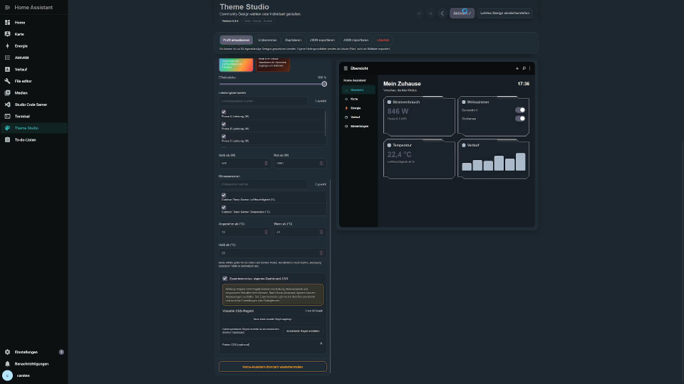
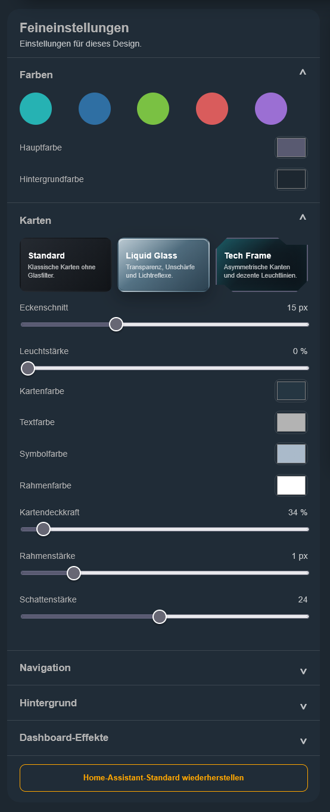
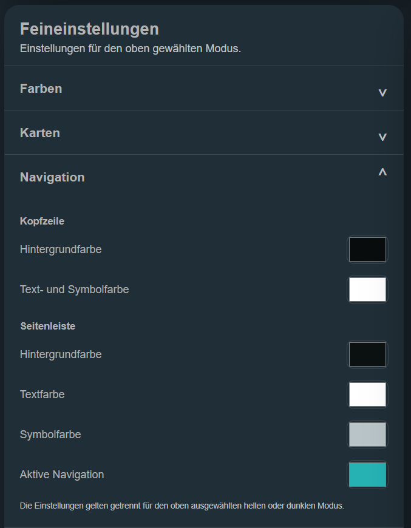
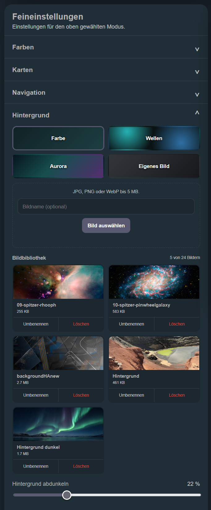
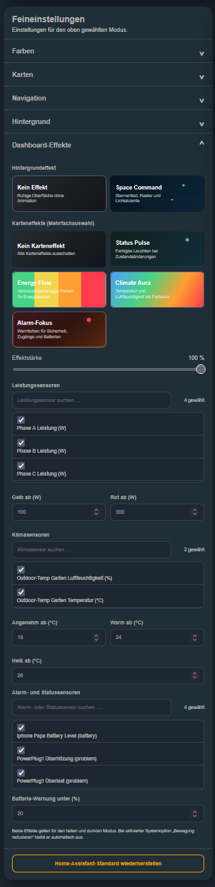

# Theme Studio 0.8.3 - Guide utilisateur

[English](USER_GUIDE.en.md) | [Deutsch](BENUTZERHANDBUCH.de.md) | **Français** | [Español](GUIA_USUARIO.es.md)

[Télécharger le PDF](../downloads/theme-studio-guide-utilisateur-fr.pdf) | [Dernière version](https://github.com/CjonesLAB/ha-theme-studio/releases/latest) | [Signaler un problème](https://github.com/CjonesLAB/ha-theme-studio/issues)

Ce guide présente l’ensemble de Theme Studio, de l’installation à la conception visuelle du tableau de bord et à la gestion sûre des règles de carte existantes. Il s’applique à la version **0.8.3**.

> Créez toujours une sauvegarde complète de Home Assistant avant une installation, une mise à jour ou une modification importante du design.



## Sommaire

1. Prérequis et compatibilité
2. Installation
3. Premier démarrage et interface
4. Galerie communautaire
5. Profils de design
6. Couleurs, cartes, navigation et arrière-plan
7. Effets du tableau de bord et des cartes
8. Mode expert et anciennes règles de position
9. Appliquer, annuler, restaurer et réinitialiser
10. Importation, exportation et publication JSON
11. Réglages par utilisateur, données et confidentialité
12. Mise à jour
13. Dépannage et méthode recommandée

## 1. Prérequis et compatibilité

Theme Studio est une intégration personnalisée Home Assistant. Les droits d’administrateur sont nécessaires pour l’installation. Un compte utilisateur normal suffit ensuite pour créer ses designs.

Theme Studio génère un véritable thème Home Assistant. Les couleurs et variables compatibles peuvent donc agir sur de nombreuses pages. Les effets de carte et le CSS expert nécessitent toutefois la structure standard des cartes **Lovelace**.

> **Limitation importante :** les tableaux de bord entièrement personnalisés ou les panneaux personnalisés qui génèrent leur propre structure HTML ou leurs propres composants Web ne sont pas pris en charge par les effets de carte ou le CSS expert. Les couleurs de base du thème peuvent encore fonctionner, mais les effets ne sont pas garantis.

À retenir également :

- Les effets sont désactivés dans les paramètres Home Assistant sous `/config` et dans les dialogues.
- L’option système **Réduire les animations** désactive automatiquement les effets animés.
- Les règles expertes peuvent nécessiter une adaptation après une mise à jour de Home Assistant.
- L’interface s’adapte à l’ordinateur, la tablette et le téléphone.

## 2. Installation

### 2.1 Recommandé : installation avec HACS

1. Ouvrez **Intégrations** dans HACS.
2. Ouvrez le menu à trois points et choisissez **Dépôts personnalisés**.
3. Saisissez `https://github.com/CjonesLAB/ha-theme-studio`.
4. Choisissez la catégorie **Intégration** et ajoutez le dépôt.
5. Ouvrez **Theme Studio** et téléchargez la dernière version.
6. Redémarrez Home Assistant.
7. Ouvrez **Paramètres -> Appareils et services -> Ajouter une intégration**.
8. Recherchez **Theme Studio** et ajoutez-le.

Theme Studio apparaît ensuite dans la barre latérale. Le module d’effets est enregistré automatiquement ; aucune entrée `frontend.extra_module_url` n’est nécessaire.

### 2.2 Installation manuelle

1. Téléchargez le paquet de la dernière version GitHub.
2. Copiez le dossier `theme_studio` dans `/config/custom_components/theme_studio`.
3. Vérifiez que les thèmes sont activés dans `/config/configuration.yaml` :

```yaml
frontend:
  themes: !include_dir_merge_named themes
```

4. Vérifiez la configuration et redémarrez Home Assistant.
5. Ajoutez Theme Studio sous **Paramètres -> Appareils et services**.

Après une installation ou une mise à jour, rechargez complètement le navigateur avec `Ctrl + F5`. Fermez et rouvrez entièrement l’application Companion.

## 3. Premier démarrage et interface

Ouvrez Theme Studio depuis la barre latérale. Les actions principales se trouvent en haut :

- **Annuler / Rétablir :** corriger les modifications non appliquées.
- **Appliquer le thème :** enregistrer les valeurs, générer le thème et l’activer pour l’utilisateur actuel.
- **Restaurer le dernier design :** revenir à l’état précédent sauvegardé automatiquement.
- **Version :** afficher la version installée.

La page contient trois zones principales :

1. **Galerie communautaire** pour les designs vérifiés.
2. **Mes profils de design** pour enregistrer et échanger des designs complets.
3. **Réglages** pour les couleurs, cartes, navigation, arrière-plan et effets.

L’aperçu réagit immédiatement. Le véritable thème Home Assistant ne change qu’après **Appliquer le thème**. Un message indique les modifications non appliquées ou non enregistrées dans le profil.

## 4. Galerie communautaire

La galerie charge des designs vérifiés depuis [ha-theme-studio.com](https://ha-theme-studio.com/). Chaque aperçu montre un tableau de bord compact et respecte le mode clair ou sombre du design.

1. Utilisez **Actualiser** si nécessaire.
2. Parcourez les designs avec les flèches ou un geste de balayage.
3. Choisissez **Importer en un clic**.
4. Sélectionnez le profil importé sous **Mes profils de design**.
5. Appuyez sur **Appliquer le thème**.

Les profils sont validés avant leur enregistrement. Les chemins d’images locaux du créateur ne sont pas importés, car les fichiers correspondants n’existent pas sur votre installation.

## 5. Profils de design

Un profil représente exactement **un design clair ou un design sombre**. Aucune variante opposée n’est générée automatiquement dans le même profil.

### Créer un profil

1. Saisissez un nom unique.
2. Choisissez **Clair** ou **Sombre**.
3. Sélectionnez **Créer un thème**.
4. Personnalisez-le dans les réglages.
5. Enregistrez le profil, puis appliquez le thème.

### Gérer les profils

- **Charger :** placer les valeurs du profil dans l’éditeur.
- **Mettre à jour :** enregistrer les modifications dans le profil sélectionné.
- **Renommer :** changer uniquement son nom.
- **Dupliquer :** créer une copie indépendante.
- **Supprimer :** retirer le profil ; le thème actif reste en place jusqu’à la prochaine application.

Jusqu’à 64 designs indépendants peuvent être enregistrés. Le dernier profil appliqué est sélectionné automatiquement à la prochaine ouverture.

## 6. Couleurs, cartes, navigation et arrière-plan

### 6.1 Couleurs

La section **Couleurs** propose une couleur principale, des accents prédéfinis et les couleurs d’arrière-plan. Vérifiez le contraste du texte dans l’aperçu puis sur le véritable tableau de bord.

### 6.2 Cartes



Trois styles sont disponibles :

- **Standard :** cartes Home Assistant classiques sans filtre de verre.
- **Liquid Glass :** transparence, flou, saturation et reflets ; les valeurs incompatibles sont gérées automatiquement.
- **Tech Frame :** coins asymétriques, contour fermé, lueur, bordure et ombre réglables.

Selon le style, vous pouvez régler le rayon ou la découpe, la couleur de carte, le texte, les icônes, la bordure, l’opacité, l’épaisseur, l’ombre, le flou et la lueur.

### 6.3 Navigation



L’en-tête et la barre latérale disposent de couleurs propres pour l’arrière-plan, le texte, les icônes et l’accent. Testez le résultat avec la barre latérale ouverte et fermée.

### 6.4 Arrière-plan



Choisissez une couleur, un dégradé ou une image. La bibliothèque accepte jusqu’à 24 fichiers JPG, PNG ou WebP.

- Seuls les administrateurs peuvent ajouter, renommer ou supprimer les images partagées.
- Chaque utilisateur peut sélectionner une image disponible pour son design personnel.
- Une image utilisée par le design actif ou un profil est protégée contre la suppression.
- **Assombrir l’arrière-plan** améliore la lisibilité sur une image claire.

## 7. Effets du tableau de bord et des cartes



### Effet d’arrière-plan

**Space Command** ajoute un champ d’étoiles et des accents lumineux. Il fonctionne en mode clair et sombre, sauf si **Réduire les animations** est activé.

### Effets de carte

Les effets ne s’appliquent qu’aux entités sélectionnées :

- **Status Pulse :** pulsation pour les états.
- **Energy Flow :** affichage lié à la consommation avec seuils d’avertissement et critique.
- **Climate Aura :** couleurs liées à la température ou à l’humidité.
- **Alarm Focus :** mise en évidence des alarmes, problèmes et batteries.

Recherchez par nom, identifiant ou classe d’appareil, puis sélectionnez plusieurs entités. **Désactiver tous les effets de carte** supprime toutes les associations.

Une carte sans structure Lovelace standard peut empêcher la détection de l’entité. Ces effets ne sont pas disponibles dans les tableaux de bord entièrement personnalisés.

## 8. Mode expert et anciennes règles de position

Le mode expert se trouve sous **Effets du tableau de bord**. Il est facultatif, expérimental et privé pour l’utilisateur actuel.

> **Transition dans la version 0.8.3 :** l’édition directe et le déplacement des cartes ont été retirés, car le positionnement en pixels n’était pas fiable sur différents appareils. Utilisez l’éditeur de tableau de bord Home Assistant pour l’ordre des cartes, les sections, la taille et la disposition. Theme Studio n’affiche plus d’icône dans la barre du tableau de bord ni de mode carte sur smartphone.

Les règles visuelles existantes restent disponibles et peuvent être activées, désactivées, modifiées, dupliquées ou supprimées. Il n’est plus possible de créer de nouveaux décalages horizontaux ou verticaux.

### 8.1 Désactiver les anciens ajustements de position

Theme Studio détecte les règles créées par d’anciennes versions qui contiennent des valeurs X/Y et affiche **Anciennes règles de position détectées**.

1. Vérifiez le design concerné avant de le modifier.
2. Sélectionnez **Désactiver tous les ajustements de position**.
3. Confirmez la demande.
4. Appliquez le design.

Seuls les décalages horizontaux et verticaux sont supprimés. L’espacement intérieur, la largeur, la hauteur minimale, les colonnes, l’opacité, la taille du texte, les coins, la cible et la restriction d’appareil restent inchangés. Les règles enregistrées ne sont pas supprimées.

### 8.2 Gérer la disposition des cartes

Utilisez l’éditeur natif de Home Assistant pour déplacer les cartes, modifier les sections, la taille ou la disposition. Le tableau de bord reste ainsi adaptatif et utilise les règles de mise en page prises en charge par Home Assistant sur ordinateur, tablette et téléphone.

### 8.3 Règles avancées et CSS libre

Le générateur avancé peut viser toutes les cartes, une entité, un identifiant personnalisé ou une carte sélectionnée directement. Ajoutez au besoin un identifiant dans le YAML :

```yaml
theme_studio_id: energie
```

La zone CSS libre est réservée aux utilisateurs expérimentés. `@import`, les URL distantes/data et les constructions exécutables anciennes sont refusés. Une règle incorrecte peut déplacer, masquer ou bloquer une carte ; réinitialisez ou désactivez d’abord la règle concernée.

## 9. Appliquer, annuler, restaurer et réinitialiser

- **Annuler / Rétablir** agit sur les modifications actuelles.
- **Mettre à jour le profil** enregistre les changements dans le profil.
- **Appliquer le thème** génère, stocke et active le thème pour l’utilisateur.
- Avant chaque application, l’état actif devient un point de restauration.
- **Restaurer le dernier design** échange l’état actif avec ce point.
- **Restaurer le thème Home Assistant par défaut** désactive Theme Studio pour l’utilisateur et revient au mode **Auto**. Profils et images sont conservés.

Si l’aperçu est correct mais pas le véritable tableau de bord, appliquez le thème ou rechargez complètement le navigateur.

## 10. Importation, exportation et publication JSON

### Exportation

**Exporter le JSON** crée un profil portable avec les couleurs et les réglages des cartes, de navigation et d’arrière-plan.

Sont volontairement exclus :

- les fichiers et chemins d’images locaux
- les effets et associations d’entités
- le CSS expert et les règles visuelles

Ces données sont propres à l’installation ou à l’utilisateur.

### Importation

1. Choisissez **Importer le JSON**.
2. Sélectionnez un fichier de 1 Mo maximum.
3. Vérifiez l’aperçu validé.
4. Confirmez explicitement.
5. Sélectionnez le profil créé et appliquez-le.

### Publication

Un profil exporté peut être envoyé avec **Soumettre un design** sur [ha-theme-studio.com](https://ha-theme-studio.com/). La connexion utilise GitHub et chaque design est contrôlé avant publication.

## 11. Réglages par utilisateur, données et confidentialité

Depuis la version 0.7.0, chaque utilisateur possède ses réglages, profils, design actif, règles expertes et points de restauration. La bibliothèque d’images reste partagée et administrée par les administrateurs.

Les données restent locales, notamment dans :

```text
/config/themes/theme_studio.yaml
/config/www/theme_studio/
/config/.storage/theme_studio.settings
/config/.storage/theme_studio.profiles
/config/.storage/theme_studio.backgrounds
```

Seule la galerie facultative communique en HTTPS avec `ha-theme-studio.com`. Les identifiants, états d’entités et images locales ne sont pas transmis. Le diagnostic Home Assistant contient uniquement des états techniques et des nombres anonymes.

## 12. Mise à jour

### HACS

1. Installez la mise à jour dans HACS.
2. Redémarrez Home Assistant.
3. Utilisez `Ctrl + F5` ou redémarrez l’application Companion.

### Manuellement

Remplacez l’intégralité de `/config/custom_components/theme_studio` par le dossier de la nouvelle version. Ne mélangez pas les fichiers de versions différentes. Redémarrez ensuite Home Assistant et l’interface.

Les mises à jour normales ne remplacent pas les profils ni les réglages personnels. Une sauvegarde reste recommandée.

## 13. Dépannage et méthode recommandée

| Problème | Solution |
| --- | --- |
| Theme Studio manque dans la barre latérale | Ajoutez l’intégration sous **Paramètres -> Appareils et services**, puis redémarrez. |
| Les changements restent dans l’aperçu | Choisissez **Appliquer le thème**. |
| L’ancienne interface reste après la mise à jour | Rechargez avec `Ctrl + F5` ou redémarrez l’application. |
| Les effets manquent | Utilisez Lovelace, choisissez des entités compatibles et vérifiez **Réduire les animations**. |
| Les effets manquent dans un tableau personnalisé | Les tableaux entièrement personnalisés et panneaux personnalisés ne sont pas pris en charge. |
| L’icône d’édition manque | Activez le mode expert et ouvrez un véritable tableau Lovelace. |
| Une règle touche plusieurs cartes | Sélectionnez la carte directement ou ajoutez une `theme_studio_id` unique. |
| Une carte saute ou devient inutilisable | Réinitialisez ou désactivez la règle concernée. |
| Une image ne peut pas être supprimée | Elle est encore utilisée par le design actif ou un profil. |
| L’import ne contient pas les effets/CSS | C’est normal : les profils JSON ne contiennent que les valeurs portables. |

Méthode recommandée :

1. Créez une sauvegarde.
2. Créez un profil clair ou sombre.
3. Réglez les couleurs et la navigation.
4. Choisissez le style de carte et l’arrière-plan.
5. Enregistrez puis appliquez le design.
6. Affectez les effets à peu d’entités adaptées.
7. Utilisez le mode expert en dernier, carte par carte ou par petits groupes.
8. Mettez le profil à jour après chaque modification importante.

Pour obtenir de l’aide, indiquez les versions de Home Assistant et Theme Studio, la plateforme, le type de tableau de bord et les journaux utiles dans le [suivi des problèmes GitHub](https://github.com/CjonesLAB/ha-theme-studio/issues).
